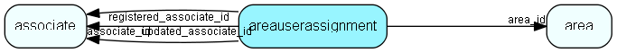

# areauserassignment Table (40)

Link table indicating which users actually reside in this area.

## Fields

| Name | Description | Type | Null |
|------|-------------|------|:----:|
|areauserassignment\_id|Primary key|PK| |
|area\_id|Parent area id|FK [area](area.md)| |
|associate\_id|Id of associate assigned to this area|FK [associate](associate.md)| |
|registered|Registered when|UtcDateTime| |
|registered\_associate\_id|Registered by whom|FK [associate](associate.md)| |
|updated|Last updated when|UtcDateTime| |
|updated\_associate\_id|Last updated by whom|FK [associate](associate.md)| |
|updatedCount|Number of updates made to this record|UShort| |

[!include[details](./includes/areauserassignment.md)]

## Indexes

| Fields | Types | Description |
|--------|-------|-------------|
|areauserassignment\_id |PK |Unique |
|area\_id |FK |Index |
|associate\_id |FK |Clustered |

## Relationships

| Table|  Description |
|------|-------------|
|[area](area.md)  |Definition of an Area (database subset for satellite and travel) |
|[associate](associate.md)  |Employees, resources and other users - except for External persons |

## Replication Flags

* Replicate changes DOWN from central to satellites and travellers.
* Copy to satellite and travel prototypes.
* Cache table during filtering.

## Security Flags

* No access control via user's Role.

