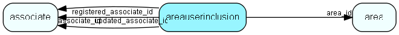

# areauserinclusion Table (41)

Link table incidated whose data should be included in this area. If Include all data in Area (no filtering) is ticket then there will be no rows for this area in this table.

## Fields

| Name | Description | Type | Null |
|------|-------------|------|:----:|
|areauserinclusion\_id|Primary key|PK| |
|area\_id|Parent area ID|FK [area](area.md)| |
|associate\_id|ID of associate whose data should be in this area|FK [associate](associate.md)| |
|registered|Registered when|UtcDateTime| |
|registered\_associate\_id|Registered by whom|FK [associate](associate.md)| |
|updated|Last updated when|UtcDateTime| |
|updated\_associate\_id|Last updated by whom|FK [associate](associate.md)| |
|updatedCount|Number of updates made to this record|UShort| |

[!include[details](./includes/areauserinclusion.md)]

## Indexes

| Fields | Types | Description |
|--------|-------|-------------|
|areauserinclusion\_id |PK |Unique |
|area\_id |FK |Index |
|associate\_id |FK |Clustered |

## Relationships

| Table|  Description |
|------|-------------|
|[area](area.md)  |Definition of an Area (database subset for satellite and travel) |
|[associate](associate.md)  |Employees, resources and other users - except for External persons |

## Replication Flags

* Replicate changes DOWN from central to satellites and travellers.
* Copy to satellite and travel prototypes.
* Cache table during filtering.

## Security Flags

* No access control via user's Role.

