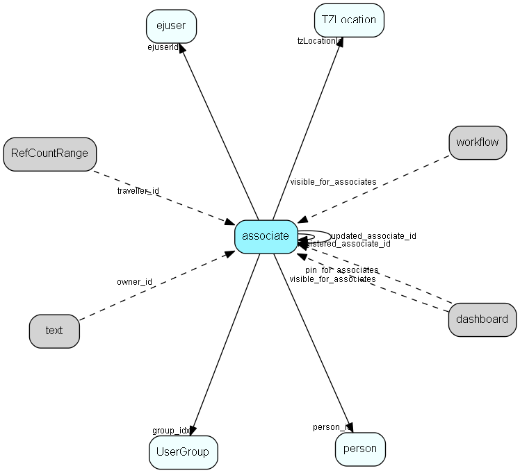

# associate Table (2)

associate MDO list item table.
Employees, resources and other users - except for External persons

## Fields

| Name | Description | Type | Null |
|------|-------------|------|:----:|
|associate\_id|Primary key|PK| |
|name|Initials, also login name, possibly database user name|String(239)| |
|rank|Rank order |UShort|&#x25CF;|
|tooltip|Tooltip or other description|String(254)|&#x25CF;|
|deleted|1 = the user is retired and should have no rights, not appear in lists, etc.|UShort|&#x25CF;|
|group\_idx|Primary group membership, see UserGroupLink for secondary memberships|FK [UserGroup](usergroup.md)| |
|lastlogin|Last login date|DateTime| |
|lastlogout|Last logout date|DateTime| |
|person\_id|Owning person record|FK [person](person.md)| |
|checklistlimit|Diary checklist scan limit|DateTime| |
|type|Associate type|Enum [AssociateType](enums/associatetype.md)|&#x25CF;|
|userFlags|user-specific GUI flags|String(127)|&#x25CF;|
|registered|Registered when|UtcDateTime| |
|registered\_associate\_id|Registered by whom|FK [associate](associate.md)| |
|updated|Last updated when|UtcDateTime| |
|updated\_associate\_id|Last updated by whom|FK [associate](associate.md)| |
|updatedCount|Number of updates|UShort| |
|isLocation|For resources only: 1 if this resource represents a location|Bool|&#x25CF;|
|tzLocationId|Default timezone location for this associate|FK [TZLocation](tzlocation.md)|&#x25CF;|
|locationAddress|Address of location, if this is a resource that is a location|String(239)|&#x25CF;|
|ejuserId|ID of the ej user record corresponding to this associate; 0 for associates that are not ej users|FK [ejuser](ejuser.md)|&#x25CF;|
|encryptedCheck|Encrypted hash checksum|String(254)| |
|userName|Associate user name|String(254)|&#x25CF;|
|waiting\_for\_approval|0 = Approved (default). 1 = Associate/User must be approved by an administrator. User cannot log in while waiting, but can be assigned licenses. Used in Online.|Bool| |

[!include[details](./includes/associate.md)]

## Indexes

| Fields | Types | Description |
|--------|-------|-------------|
|associate\_id |PK |Clustered, Unique |
|name |String(239) |Unique |
|person\_id |FK |Index |
|type |Enum |Index |

## Relationships

| Table|  Description |
|------|-------------|
|[address](address.md)  |Contact and Person addresses |
|[AddressFormat](addressformat.md)  |Address formats for GUI and labels. See more information: Addressformat on http://techdoc.superoffice.com |
|[ai\_chat\_turn](ai-chat-turn.md)  |Contains AI Chatbot history - contains whole chat, not just what is sent to the chatbot. History is ready ordered by timestamp |
|[AmountClass](amountclass.md)  |Amount Class list for SuperOffice Sales Intelligence (Saint) - used to group sales by amounts, into bins (low --&gt; high) called amount classes. More information regarding SuperOffice Sales Intelligence on http://techdoc.superoffice.com  |
|[AmountClassGroupLink](amountclassgrouplink.md)  |User group link table for AmountClass, for MDO item hiding |
|[AmountClassHeadingLink](amountclassheadinglink.md)  |Heading link table for AmountClass, for MDO headers |
|[appointment](appointment.md)  |Tasks, appointments, followups, phone calls; and documents (document_id != 0). An appointment always has a corresponding record in VisibleFor specifying who may see this.  |
|[area](area.md)  |Definition of an Area (database subset for satellite and travel) |
|[areauserassignment](areauserassignment.md)  |Link table indicating which users actually reside in this area. |
|[areauserinclusion](areauserinclusion.md)  |Link table incidated whose data should be included in this area. If Include all data in Area (no filtering) is ticket then there will be no rows for this area in this table. |
|[associate](associate.md)  |Employees, resources and other users - except for External persons |
|[AssociateGroupLink](associategrouplink.md)  |User group link table for Associate, for MDO item hiding |
|[AssociateHeadingLink](associateheadinglink.md)  |Heading link table for associate for display only. Supportive table, used for grouping and filtering on lists.  |
|[AssociateHistory](associatehistory.md)  |Historical information about associates that have been deleted. Most references are NOT declared as foreign keys; this is a historical table that should not be updated when further changes occur in the database |
|[attachment\_location](attachment-location.md)  |A location for storing attachments |
|[AudienceConfig](audienceconfig.md)  |Configuration data for Audience core and webparts |
|[AudienceLayout](audiencelayout.md)  |One layout (of webparts and other stuff) for an audience instance |
|[AudienceLayoutLink](audiencelayoutlink.md)  |Link between an audience layout and some target grouping table - might be Role or Category |
|[AudienceVisibility](audiencevisibility.md)  |How projects (or whatever) should be made visible in audience |
|[BaseTZLocation](basetzlocation.md)  |Time zone location for the database (how tz-related datetimes should be stored in the database) |
|[BatchTask](batchtask.md)  |Batch task request details, corresponding to the message body of a batch request message |
|[BatchTaskDefinition](batchtaskdefinition.md)  |Batch task definitiopns, populated from the SuperOffice.CRM.BatchProcessing.BatchTask attribute |
|[BinaryObject](binaryobject.md)  |Binary objects, i.e., blobs. Used for images, documents, SuperOffice inbox mail  and other large binary items |
|[BinaryObjectLink](binaryobjectlink.md)  |Link table, connects a BinaryObject with one or more owners |
|[Business](business.md)  |Business list table |
|[BusinessGroupLink](businessgrouplink.md)  |User group link table for Business, for MDO item hiding |
|[BusinessHeadingLink](businessheadinglink.md)  |Heading link table for Business, for MDO headers |
|[Category](category.md)  |Category list table |
|[CategoryFamily](categoryfamily.md)  |Grouping table so that multiple company categories can be grouped under one term; to simplify searching for things like &apos;all customers&apos; |
|[CategoryGroupLink](categorygrouplink.md)  |User group link table for Category, for MDO item hiding |
|[CategoryHeadingLink](categoryheadinglink.md)  |Heading link table for Category, for MDO headers |
|[cc\_template](cc-template.md)  |This table contains templates for the customer center |
|[company](company.md)  |Information on license and owner of this SuperOffice database. This table should only have 1 row. This table contains encrypted license information. Changing it will disable login for all users and require you to restore the database from backup. |
|[Comptr](comptr.md)  |Comptr list table. List of all possible competitors (sale). |
|[ComptrGroupLink](comptrgrouplink.md)  |User group link table for Comptr, for MDO item hiding |
|[ComptrHeadingLink](comptrheadinglink.md)  |Heading link table for Comptr, for MDO headers |
|[ConfigurableScreenAppliesTo](configurablescreenappliesto.md)  |Mapping between recipes in scil and chosen type of data (appliesToKey) to differ layouts on |
|[ConfigurableScreenDelta](configurablescreendelta.md)  |Parts of recipes in SCIL to insert or remove in given recipes |
|[ConnectionConfigField](connectionconfigfield.md)  |Configuration data for Erp and Quote Connections |
|[ConsentPerson](consentperson.md)  |Link table that defines who has which consents |
|[ConsentPurpose](consentpurpose.md)  |GDPR purpose alternatives |
|[ConsentSource](consentsource.md)  |Consent source for GDPR |
|[contact](contact.md)  |Companies and Organizations.   This table features a special record containing information about the contact that owns the database.   |
|[contactinterest](contactinterest.md)  |Link-table between contact and interests in ContInt |
|[ContInt](contint.md)  |ContInt list table. List-text of all valid contact interest types. |
|[ContIntGroupLink](contintgrouplink.md)  |User group link table for ContInt, for MDO item hiding |
|[ContIntHeadingLink](contintheadinglink.md)  |Heading link table for ContInt, for MDO headers |
|[CounterValue](countervalue.md)  |Visible for rights |
|[country](country.md)  |Country information |
|[CountryGroupLink](countrygrouplink.md)  |User group link table for Country, for MDO item hiding |
|[CountryHeadingLink](countryheadinglink.md)  |Heading link table for Country, for MDO headers |
|[Credentials](credentials.md)  |Alternative credentials |
|[Credited](credited.md)  |Credited list table. List of who is to be credited for the sale. |
|[CreditedGroupLink](creditedgrouplink.md)  |User group link table for Credited, for MDO item hiding |
|[CreditedHeadingLink](creditedheadinglink.md)  |Heading link table for Credited, for MDO headers |
|[Currency](currency.md)  |Currency list table |
|[CurrencyGroupLink](currencygrouplink.md)  |User group link table for Currency, for MDO item hiding |
|[CurrencyHeadingLink](currencyheadinglink.md)  |Heading link table for Currency, for MDO headers |
|[cust\_config](cust-config.md)  |This table contains JSON structures used for customizing the customer center |
|[dashboard](dashboard.md)  |Describes a dashboard |
|[dashboard\_theme](dashboard-theme.md)  |A set of style rules for the Dashboard |
|[dashboard\_tile](dashboard-tile.md)  |Represents one tile in the dashboard |
|[dashboard\_tile\_definition](dashboard-tile-definition.md)  |Describes the contents of a tile |
|[dashboard\_tile\_field](dashboard-tile-field.md)  |Describes the contents of a tile field |
|[DataRight](dataright.md)  |Data right definition |
|[DeliveryTerms](deliveryterms.md)  |The list of Delivery terms, in the internal product register |
|[DeliveryTermsGroupLink](deliverytermsgrouplink.md)  |User group link table for DeliveryTerms, for MDO item hiding |
|[DeliveryTermsHeadingLink](deliverytermsheadinglink.md)  |Heading link table for DeliveryTerms, for MDO item headings |
|[DeliveryType](deliverytype.md)  |The list of Delivery types, in the internal product register |
|[DeliveryTypeGroupLink](deliverytypegrouplink.md)  |User group link table for DeliveryType, for MDO item hiding |
|[DeliveryTypeHeadingLink](deliverytypeheadinglink.md)  |Heading link table for DeliveryType, for MDO item headings |
|[DiaryView](diaryview.md)  |Configuration of a multi-user diary view |
|[DiaryViewRow](diaryviewrow.md)  |Configuration of a multi-user diary view |
|[DocTmpl](doctmpl.md)  |DocTmpl list table. Describes templates available for writing new documents. |
|[DocTmplGroupLink](doctmplgrouplink.md)  |User group link table for DocTmpl, for MDO item hiding |
|[DocTmplHeadingLink](doctmplheadinglink.md)  |Heading link table for DocTmpl, for MDO headers |
|[document](document.md)  |Documents, this table is an extension of the Appointment table.  There is always a corresponding appointment record; the relation between appointment and document is navigable in both directions. A document-type appointment record always has a corresponding document record and a record in VisibleFor specifying who may see this.   |
|[EjCategoryGroupLink](ejcategorygrouplink.md)  |User group link table for EjCategory, for mass handling ej_category members |
|[ejscript](ejscript.md)  |ejscript |
|[ejuser](ejuser.md)  |This table contains entries for the users of the system. |
|[Email](email.md)  |Email addresses for contacts, projects and persons |
|[email\_account](email-account.md)  |Email account information |
|[email\_flow](email-flow.md)  |A set of properties related to the email workflow. |
|[email\_flow\_content\_link](email-flow-content-link.md)  |Links content to an email workflow |
|[email\_folder](email-folder.md)  |Corresponds to an email folder on a mail server |
|[email\_item](email-item.md)  |Email data |
|[EntityCounts](entitycounts.md)  |Number of different entities an associate has created for usage statistics |
|[ErpConfiguration](erpconfiguration.md)  |Global settings for the Erp Integration Server |
|[ErpConnection](erpconnection.md)  |One connection to an ERP connector, specifying Client and other required information |
|[ErpConnectionAccess](erpconnectionaccess.md)  |Access control for Erp Connections |
|[ErpConnectionActorType](erpconnectionactortype.md)  |Data about the configuration of one Erp Actor on one ErpConnection |
|[ErpConnector](erpconnector.md)  |One ERP Connector, known by its URL |
|[ErpExternalKey](erpexternalkey.md)  |The external (ERP-facing) key related to a synchronized record / connection |
|[ErpField](erpfield.md)  |Store the metadata describing the fields that belong to an actor/connection combination, as described by the Erp Connector |
|[ErpInternalKey](erpinternalkey.md)  |The internal (superoffice-facing) key related to a synchronized record |
|[ErpListItemMapping](erplistitemmapping.md)  |Defines a mapping of ERP to CRM fields, per connection and actor type |
|[ErpSyncLog](erpsynclog.md)  |Record all field changes done by the Erp Sync |
|[ExtApp](extapp.md)  |ExtApp list table. Applications startable from SuperOffice |
|[ExtAppGroupLink](extappgrouplink.md)  |User group link table for ExtApp, for MDO item hiding |
|[ExtAppHeadingLink](extappheadinglink.md)  |Heading link table for ExtApp, for MDO headers |
|[ExternalEvent](externalevent.md)  |The definition of projects as events in Audience (or other Collaborative apps) |
|[Favourite](favourite.md)  |Favourite records (star-marking) |
|[FieldLabel](fieldlabel.md)  |Field label override table, makes it possible to override internal string resources. Define your own text for the panels in SuperOffice, e.g. rename Project to Cars in SOAdmin - System Options - Labels  This table contains controlling data for the string substitution mechanism. There is one row in this table for each label or string that can be substituted; the active field indicates whether the string is actually being substituted or not. Initially, all rows have this field set to 0. The table is loaded with initial data during database setup.  Only SuperOffice Development has the necessary expertise to safely add rows to this table.  If a row has active = 1, the table LocaleText should contain one or more rows pointing back to this table, with the actual text to be used.  |
|[foreignapp](foreignapp.md)  |Top level of Foreign Key system |
|[foreigndevice](foreigndevice.md)  |Middle level of Foreign Key system |
|[foreignkey](foreignkey.md)  |Foreign Key - enables storage of arbitrary extra key information for every table/row in SuperOffice. You may use this table to store your extra information instead of using the dictionary SDK to create your own tables. |
|[form](form.md)  |A form which can be published on a webpage and submitted by visitors |
|[form\_field\_value](form-field-value.md)  |Form field values saved in a searchable format |
|[FunctionRight](functionright.md)  |Functional right definition |
|[FunctionRightRoleLink](functionrightrolelink.md)  |Functional right definition |
|[Heading](heading.md)  |Heading items for all MDO lists, lists that are grouped and filtered. |
|[hierarchy](hierarchy.md)  |This table contains folders used to group the extra tables in the system. |
|[History](history.md)  |History lists for lists and searchable controls. Maintains history for Navigator or other search (find dialogs). A single table may have more than one record here, as indicated by the extra_id field. The HistorySize (preference may be set in maintenance client) defines how many records you can have in a history list. |
|[ImportDefault](importdefault.md)  |Defaults for import fields/objects |
|[ImportField](importfield.md)  |Import object types - see localetext for names |
|[ImportObject](importobject.md)  |Import object types - see localetext for names. |
|[ImportRelation](importrelation.md)  |Relations between import objects |
|[Intent](intent.md)  |Intent list for SAINT. More information regarding SuperOffice Sales Intelligence on http://techdoc.superoffice.com  |
|[IntentGroupLink](intentgrouplink.md)  |User group link table for Intent, for MDO item hiding |
|[IntentHeadingLink](intentheadinglink.md)  |Heading link table for Intent, for MDO headers |
|[invitation](invitation.md)  |Invitations to events |
|[LanguageInfo](languageinfo.md)  |Information about languages, from ISO standards and related information |
|[LanguageInfoCountry](languageinfocountry.md)  |Many-many link between countries and languages, to give intelligent choices for language |
|[LegalBase](legalbase.md)  |Legal base for GDPR (Article 6) |
|[LicenseAssocLink](licenseassoclink.md)  |Link between ModuleLicense and Associate, for per-assoc licenses; this is how licenses are assigned/consumed |
|[LicenseSatlLink](licensesatllink.md)  |Link between License and Satellite, for per-database licenses |
|[LocaleText](localetext.md)  |Multi-language text items. Used for user-defined field labels. Must be assigned correct name to match the language they start SuperOffice in.  This table should be viewed in conjunction with FieldLabel. If a row in FieldLable has active = 1 this table will need to contain at least one row with the same resourceId as the FieldLabel row. The language id can be either 0 or one of the Windows language ID&apos;s; SuperOffice will pick the correct language on startup according to the user settings. If a label cannot be found with the given language and also not with language 0, it will not be substituted.  |
|[MailingDomains](mailingdomains.md)  |List of allowed domains used in a Mailing |
|[MergeMoveLog](mergemovelog.md)  |Log of merge and move operations (person, contact, project) |
|[Message](message.md)  |Definition of a message, corresponding to the header of a protocol |
|[MessageHandler](messagehandler.md)  |Presence and heartbeat of a message handler, should be updated once a minute. Older records are stale |
|[ModuleLicense](modulelicense.md)  |Module licenses, belonging to one single owner |
|[ModuleOwner](moduleowner.md)  |Unique owner of a set of licensed modules |
|[MrMrs](mrmrs.md)  |MrMrs list table. List of salutations. |
|[MrMrsGroupLink](mrmrsgrouplink.md)  |User group link table for MrMrs, for MDO item hiding |
|[MrMrsHeadingLink](mrmrsheadinglink.md)  |Heading link table for MrMrs, for MDO headers |
|[notify](notify.md)  |This table contains the pop-up messages displayed for users for various events, such as &amp;apos;new ticket&amp;apos;, etc. |
|[OLEField](olefield.md)  |Control data table for the OLE DB Provider |
|[OLEFieldText](olefieldtext.md)  |Control data table for the OLE DB Provider |
|[OLESubject](olesubject.md)  |Control data table for the OLE DB Provider |
|[OLESubjectText](olesubjecttext.md)  |Control data table for the OLE DB Provider |
|[OLEView](oleview.md)  |Control data table for the OLE DB Provider |
|[OLEViewText](oleviewtext.md)  |Control data table for the OLE DB Provider |
|[OnlineApp](onlineapp.md)  |Echo and track information about Online Apps and their usage |
|[outgoing\_message](outgoing-message.md)  |Delivery of outgoing messages to messageplugins, updated with status asynchroneously |
|[OwnerContactLink](ownercontactlink.md)  |Table specifying which contacts can own associates.  All contacts that have rows in this table (i.e. rows with contact_id pointing to them) will be offered as associate owners in the maintenance client and as candidate Satellite owners. Such contacts have restrictions on editing and deletion to protect database consistency.  |
|[PaymentTerms](paymentterms.md)  |The list of payment terms, in the internal product register |
|[PaymentTermsGroupLink](paymenttermsgrouplink.md)  |User group link table for PaymentTerms, for MDO item hiding |
|[PaymentTermsHeadingLink](paymenttermsheadinglink.md)  |Heading link table for PaymentTerms, for MDO item headings |
|[PaymentType](paymenttype.md)  |The list of payment types, in the internal product register |
|[PaymentTypeGroupLink](paymenttypegrouplink.md)  |User group link table for PaymentType, for MDO item hiding |
|[PaymentTypeHeadingLink](paymenttypeheadinglink.md)  |Heading link table for PaymentType, for MDO item headings |
|[PersInt](persint.md)  |PersInt list table. List of Person interests. |
|[PersIntGroupLink](persintgrouplink.md)  |User group link table for PersInt, for MDO item hiding |
|[PersIntHeadingLink](persintheadinglink.md)  |Heading link table for PersInt, for MDO headers |
|[person](person.md)  |Persons in a company or an organizations. All associates have a corresponding person record |
|[personinterest](personinterest.md)  |Note: If you add or remove rows in this table, you will need to update the interestCount field in the person table accordingly. This field should always reflect the number of interest records a person has, to enable the correct setting of the interest indicator on the tab in the person dialog.  Replication note: The combination of person_id and pinterest_idx is unique. If a duplicate is made on a replicated database, the system will replace the record in the target database with the one derived from the source database during replication. Therefore, do not assume that a record in this table will retain its ID indefinitely, even if the person keeps the interest. |
|[PersPos](perspos.md)  |PersPos list table. Contact person position list |
|[PersPosGroupLink](persposgrouplink.md)  |User group link table for PersPos, for MDO item hiding |
|[PersPosHeadingLink](persposheadinglink.md)  |Heading link table for PersPos, for MDO headers |
|[phone](phone.md)  |Contact and Person phonenumbers (+fax) |
|[PhoneFormat](phoneformat.md)  |Formatting information for telephone numbers |
|[PMembType](pmembtype.md)  |PMembType list table. List text of titles (member types) for project members. |
|[PMembTypeGroupLink](pmembtypegrouplink.md)  |User group link table for PMembType, for MDO item hiding |
|[PMembTypeHeadingLink](pmembtypeheadinglink.md)  |Heading link table for PMembType, for MDO headers |
|[PrefDesc](prefdesc.md)  |Preference description, drives the Preference GUI. Maintenance client - controls all preferences in SuperOffice. You find an overview off all standard preference on http://techdoc.superoffice.com.  May be used by third-party developers to add system preferences to be updated from SuperOffice Maintenance client, instead of ini-files.  |
|[PrefDescLine](prefdescline.md)  |Preference description - multiple choice line - drives the Preference GUI. May be used by third-party developers to add system preferences to be updated from SuperOffice Maintenance client, instead of ini-files. |
|[preference](preference.md)  |Not quite obsolete preference table; historical info mostly. From 6.1 this table now holds an upgrade stamp. |
|[PriceList](pricelist.md)  |List of prices, cached from an ERP system |
|[PriceUnit](priceunit.md)  |The list of price units, in the internal product register (meter, ton, bushel, microsecond, gradus, τρυβλίον, 五合枡, دونم or whatever) |
|[PriceUnitGroupLink](priceunitgrouplink.md)  |User group link table for PriceUnit, for MDO item hiding |
|[PriceUnitHeadingLink](priceunitheadinglink.md)  |Heading link table for PriceUnit, for MDO item headings |
|[Priority](priority.md)  |Priority list table. Used with appointments: low, high. |
|[PriorityGroupLink](prioritygrouplink.md)  |User group link table for Priority, for MDO item hiding |
|[PriorityHeadingLink](priorityheadinglink.md)  |Heading link table for Priority, for MDO headers |
|[Prob](prob.md)  |Prob list table. Probability, used in  sales . |
|[ProbGroupLink](probgrouplink.md)  |User group link table for Prob, for MDO item hiding |
|[ProbHeadingLink](probheadinglink.md)  |Heading link table for Prob, for MDO headers |
|[Product](product.md)  |One Product, member of one price list |
|[ProductCategory](productcategory.md)  |List for the ProductCategory field of the Product table (Quote Management) |
|[ProductCategoryGroupLink](productcategorygrouplink.md)  |User group link table for ProductCategory, for MDO item hiding |
|[ProductCategoryHeadingLink](productcategoryheadinglink.md)  |Heading link table for ProductCategory, for MDO item headings |
|[ProductFamily](productfamily.md)  |List for the ProductFamily field of the Product table (Quote Management) |
|[ProductFamilyGroupLink](productfamilygrouplink.md)  |User group link table for ProductFamily, for MDO item hiding |
|[ProductFamilyHeadingLink](productfamilyheadinglink.md)  |Heading link table for ProductFamily, for MDO item headings |
|[ProductType](producttype.md)  |List for the ProductType field of the Product table (Quote Management) |
|[ProductTypeGroupLink](producttypegrouplink.md)  |User group link table for ProductType, for MDO item hiding |
|[ProductTypeHeadingLink](producttypeheadinglink.md)  |Heading link table for ProductType, for MDO item headings |
|[ProductVersion](productversion.md)  |Version information for code modules. Owner + code module must be unique |
|[project](project.md)  |Projects |
|[projectmember](projectmember.md)  |Project members. Link-table between person and project |
|[ProjectTypeStatusLink](projecttypestatuslink.md)  |Many-many link table between project type and status, similar to sale type-stage link; and an anchor point for guide items |
|[ProjStatus](projstatus.md)  |ProjStatus list table. Project status |
|[ProjStatusGroupLink](projstatusgrouplink.md)  |User group link table for ProjStatus, for MDO item hiding |
|[ProjStatusHeadingLink](projstatusheadinglink.md)  |Heading link table for ProjStatus, for MDO headers |
|[ProjType](projtype.md)  |ProjType list table. List of valid Project types. |
|[ProjTypeGroupLink](projtypegrouplink.md)  |User group link table for ProjType, for MDO item hiding |
|[ProjTypeHeadingLink](projtypeheadinglink.md)  |Heading link table for ProjType, for MDO headers |
|[Publish](publish.md)  |Publishing system for external users |
|[PushNotificationService](pushnotificationservice.md)  |Used for storing handles to user devices that should receive push notifications |
|[quick\_reply](quick-reply.md)  |Personal quick reply text fragments |
|[Quote](quote.md)  |Quote root level, at most one per Sale, always connected to one Sale |
|[QuoteAlternative](quotealternative.md)  |Quote Version is made up of one or more Alternatives. One of 1..n possible alternatives in a Quote Version. The reason we have alternatives is that a quote can say to a customer, “we can solve you problem in two (or more) different ways, with different technology and sideeffects (and price)”. An Alternative may have discounts on the total amount. The Alternative tracks whether the user on the order level entered the Discount , Earning amount or the TotalPrice fields so that the discount and earning and total can be re-calculated correctly when Quote Lines are added or changed. |
|[QuoteApprReason](quoteapprreason.md)  |Predefined reasons for quote approval |
|[QuoteApprReasonGroupLink](quoteapprreasongrouplink.md)  |User group link table for QuoteApprReason, for MDO item hiding |
|[QuoteApprReasonHeadingLink](quoteapprreasonheadinglink.md)  |Heading link table for QuoteApprReason, for MDO headers |
|[QuoteConnection](quoteconnection.md)  |Primary key in the CRM database. Definition of a connection to an external system, for the Quote system. |
|[QuoteConnectionAccess](quoteconnectionaccess.md)  |Access control for Quote Connections |
|[QuoteDenyReason](quotedenyreason.md)  |Predefined reasons for quote denial |
|[QuoteDenyReasonGroupLink](quotedenyreasongrouplink.md)  |User group link table for QuoteDenyReason, for MDO item hiding |
|[QuoteDenyReasonHeadingLink](quotedenyreasonheadinglink.md)  |Heading link table for QuoteDenyReason, for MDO headers |
|[QuoteLine](quoteline.md)  |One line in a QuoteAlternative. QuoteLines are mainly information copied from the Products provider. Products information is sometimes edited by the user before being included in the quote, so most information is duplicated from Product rather than referenced directly. |
|[QuoteLineConfiguration](quotelineconfiguration.md)  |Configuration of quote lines - which fields are in use, rights, labels etc |
|[QuoteVersion](quoteversion.md)  |There may be multiple Versions of a Quote, with one of them active |
|[QuoteVersionAttachment](quoteversionattachment.md)  |Actual attachments to a quote |
|[Reason](reason.md)  |Reason list table. Why we lost the sale (list) |
|[ReasonGroupLink](reasongrouplink.md)  |User group link table for Reason, for MDO item hiding |
|[ReasonHeadingLink](reasonheadinglink.md)  |Heading link table for Reason, for MDO headers |
|[ReasonSold](reasonsold.md)  |Why was the sale marked as sold (why did we succeed) |
|[ReasonSoldGroupLink](reasonsoldgrouplink.md)  |User group link table for ReasonSold, for MDO item hiding |
|[ReasonSoldHeadingLink](reasonsoldheadinglink.md)  |Heading link table for ReasonSold, for MDO headers |
|[ReasonStalled](reasonstalled.md)  |Why was the sale marked as stalled |
|[ReasonStalledGroupLink](reasonstalledgrouplink.md)  |Link table for ReasonStalled, for MDO item hiding |
|[ReasonStalledHeadingLink](reasonstalledheadinglink.md)  |Heading link table for ReasonStalled, for MDO headers |
|[RecurrenceRule](recurrencerule.md)  |The recurrency pattern for a recurring event. Each recurring event has an appointment.recurrenceRuleId pointing to its pattern. |
|[RefCountRange](refcountrange.md)  |Number allocation system, for keeping track of ranges of numbers loaned out to travel and satellite databases |
|[RefCounts](refcounts.md)  |Number counter for all tables that generate numbers, e.g. templates, contacts...   This table is used for the number allocation system and should not be confused with sequence, used for allocating internal ID&apos;s. This table is replicated during generation of satellites and during local update for travellers, using special logic. By default it contains rows for the SuperOffice standard counters, including one row for each DocTemplate record.  It is permissible to add new rows to this table, and such records are maintainable through the Maintenance client.  Changing the contents of the standard records is not recommended.  |
|[RejectReason](rejectreason.md)  |Rejection reason (suggested) for bookings |
|[RejectReasonGroupLink](rejectreasongrouplink.md)  |User group link table for Comptr, for MDO item hiding |
|[RejectReasonHeadingLink](rejectreasonheadinglink.md)  |Heading link table for RejectReason, for MDO headers |
|[relationdefinition](relationdefinition.md)  |Definition of a relation. This table defines the relations that can exist in the database. Each relation has an active text and a passive text. The table RelationTarget specifies which pairs of tables this relation can connect.  Use of the active and passive texts is dependent on which direction the relation is viewed in, e.g., active text = &quot;Owns&quot; and passive text = &quot;Is owned by&quot;. |
|[relations](relations.md)  |Instance of a relation, in principle between any two records, as long as they are defined in RelationDefinition. All instances of relations are held in this table; their definitions are in the RelDef table (RelDef + RelTarg define which relations you can have, this table contains the relations the user has actually entered). From 6.1 all links between appointments, sales and documents are also stored in this tabel. |
|[relationtarget](relationtarget.md)  |Definition of targets for a relation. Links a relation definition (RelDef) to source and target tables. In general, a relation can be created between any pair of tables. This table is used for specifying which table pairs a particular relation can be used for. A relation definition should have at least one row in this table, and can have more. Note: The 5.0 Maintenance and GUI only support contact and person as valid values for the source_table and destination_table fields, in any combination. Other relations will not be shown, and relation definitions pointing to other tables will not be editable from the Maintenance GUI; however, nothing will crash. |
|[RelDefGroupLink](reldefgrouplink.md)  |User group link table for RelDef, for MDO item hiding |
|[RelDefHeadingLink](reldefheadinglink.md)  |Heading link table for RelDef, for MDO headers |
|[ReporterListDef](reporterlistdef.md)  |Reporter definitions |
|[ResourceOverride](resourceoverride.md)  |Generic mechanism for overriding (or even defining new) text resources, in multiple languages |
|[Role](role.md)  |User roles for role-based security, names and tooltips are in LocaleText. For more information regarding role based security, see http://techdoc.superoffice.com |
|[s\_link](s-link.md)  |Links in messages to measure success rate of a campaign. |
|[s\_message](s-message.md)  |A message used in a shipment. Can be html and/or plain text |
|[s\_messageblock](s-messageblock.md)  |Contains a block of a mailing message, that can be reused in a mailing |
|[s\_picture\_entry](s-picture-entry.md)  |This table describes each picture in the database |
|[s\_picture\_folder](s-picture-folder.md)  |This table contains all picture folders |
|[s\_shipment](s-shipment.md)  |Contains info about one shipment. The addresses are stored in s_shipment_addr |
|[SaintConfiguration](saintconfiguration.md)  |Configuration information for the Saint system |
|[sale](sale.md)  |Sales  For every Sale record edited through the SuperOffice GUI, a copy of the current version of the record will be saved in the SaleHist table. This also applies to editing done through the SaleModel COM interface, but not to editing done through the OLE DB Provider or other channels.   |
|[SaleHist](salehist.md)  |Mirror image of the Sale table, providing a full transaction history. Every time you edit a sale, the current record of the sale is also saved here.  |
|[SaleStakeholder](salestakeholder.md)  |Stakeholders in the sale, very similar to project members |
|[SaleType](saletype.md)  |Type of sale - large solution, incremental, whatever fits the organization |
|[SaleTypeCat](saletypecat.md)  |Category for sale type |
|[SaleTypeCatGroupLink](saletypecatgrouplink.md)  |User group link table for SaleTypeCat, for MDO item hiding |
|[SaleTypeCatHeadingLink](saletypecatheadinglink.md)  |Heading link table for SaleTypeCat, for MDO headers |
|[SaleTypeGroupLink](saletypegrouplink.md)  |User group link table for SaleType, for MDO item hiding |
|[SaleTypeHeadingLink](saletypeheadinglink.md)  |Heading link table for SaleType, for MDO headers |
|[SaleTypeQuoteAttachment](saletypequoteattachment.md)  |Default attachments to quotes linked to sales of this type |
|[SaleTypeStageLink](saletypestagelink.md)  |Many-many link table between sale type and stage; and an anchor point for guide items |
|[Salutation](salutation.md)  |Academic title for Person |
|[SalutationGroupLink](salutationgrouplink.md)  |User group link table for Salutation, for MDO item hiding |
|[SalutationHeadingLink](salutationheadinglink.md)  |Heading link table for Salutation, for MDO headers |
|[satellite](satellite.md)  |Definition of Satellites |
|[screen\_chooser](screen-chooser.md)  |Screen choosers |
|[script\_trace](script-trace.md)  |Scripts which should be traced |
|[script\_trace\_run](script-trace-run.md)  |Traces of executed scripts |
|[SearchCat](searchcat.md)  |SearchCat list table |
|[SearchCatGroupLink](searchcatgrouplink.md)  |User group link table for SearchCat, for MDO item hiding |
|[SearchCatHeadingLink](searchcatheadinglink.md)  |Heading link table for SearchCat, for MDO headers |
|[SearchCriteria](searchcriteria.md)  |Criteria storage for Selection and other Find mechanisms |
|[SearchCriteriaGroup](searchcriteriagroup.md)  |Criteria storage for Selection and other Find mechanisms |
|[SearchCriterion](searchcriterion.md)  |Criteria storage for Selection and other Find mechanisms |
|[SearchCriterionValue](searchcriterionvalue.md)  |Criteria storage for Selection and other Find mechanisms |
|[selection](selection.md)  |Selections |
|[service\_auth](service-auth.md)  |Authentication for a service (imap, smtp...) |
|[ShipmentType](shipmenttype.md)  |Shipment type list table. Classification of a mailing, allowing recipients to subscribe to lists |
|[ShipmentTypeReservation](shipmenttypereservation.md)  |ShipmentTypes a person has reserved against. Note that the absense of a record here implies acceptance of a mailings of this type |
|[SORCriteria](sorcriteria.md)  |SuperOffice reporter data |
|[SORFCT](sorfct.md)  |SuperOffice reporter data |
|[SORField](sorfield.md)  |SuperOffice reporter data |
|[SORLabelLayout](sorlabellayout.md)  |SuperOffice reporter data |
|[SOROperators](soroperators.md)  |SuperOffice reporter data |
|[SORPublish](sorpublish.md)  |SuperOffice reporter data |
|[SORPublishGroupLink](sorpublishgrouplink.md)  |Link table used for filtering reports by user group |
|[SORSection](sorsection.md)  |SuperOffice reporter data |
|[SORTemplate](sortemplate.md)  |SuperOffice reporter data |
|[Source](source.md)  |Source list table. Source for sale (list) |
|[SourceGroupLink](sourcegrouplink.md)  |User group link table for Source, for MDO item hiding |
|[SourceHeadingLink](sourceheadinglink.md)  |Heading link table for Source, for MDO headers |
|[StakeholderRole](stakeholderrole.md)  |Role a stakeholder has in a sale |
|[StakeholderRoleGroupLink](stakeholderrolegrouplink.md)  |User group link table for StakeholderRole, for MDO item hiding |
|[StakeholderRoleHeadingLink](stakeholderroleheadinglink.md)  |Heading link table for StakeholderRole, for MDO headers |
|[StatusDef](statusdef.md)  |Status definitions. Name and description are in LocaleText for internationalization |
|[StatusValue](statusvalue.md)  |Values for statuses |
|[SubscriptionUnit](subscriptionunit.md)  |The list of Subscription units, in the internal product register (year/quarter/month etc., or perhaps amounts if volume-based subscription) |
|[SubscriptionUnitGroupLink](subscriptionunitgrouplink.md)  |User group link table for SubscriptionUnit, for MDO item hiding |
|[SubscriptionUnitHeadingLink](subscriptionunitheadinglink.md)  |Heading link table for SubscriptionUnit, for MDO item headings |
|[SuggestedAppointment](suggestedappointment.md)  |Defines a suggested appointment for use in a Sale Guide or Project Guide |
|[SuggestedDocument](suggesteddocument.md)  |Unique owner of a set of licensed modules |
|[SuperListColumnSize](superlistcolumnsize.md)  |Stores the relative size (in percent) or in characters of a column in a SuperList |
|[SystemEvent](systemevent.md)  |System events, such as freetext rebuild, SAINT rebuild and such. Makes broadcasts to keep its siblings and clients updated.  |
|[TabOrder](taborder.md)  |Order of tabs within a tab control, if configured by a user |
|[Tags](tags.md)  |MDO List of tags for Service entities |
|[TagsGroupLink](tagsgrouplink.md)  |User group link table for Tags, for MDO item hiding |
|[TagsHeadingLink](tagsheadinglink.md)  |Heading link table for Source, for MDO headers |
|[target\_assignment\_info](target-assignment-info.md)  |Linking associate, company or user group target and other information with target values |
|[target\_assignment\_value](target-assignment-value.md)  |A set of values linked to assignment info and a period in a target group. |
|[target\_change](target-change.md)  |A single field change. |
|[target\_dimension](target-dimension.md)  |Defining target dimension |
|[target\_group](target-group.md)  |Info about a set of (sales, project, selection...) targets |
|[target\_period](target-period.md)  |A set of periods linked with target amounts for users/usergroups and the target groups/years. |
|[target\_revision](target-revision.md)  |One batch of changes made to targets |
|[target\_revision\_history](target-revision-history.md)  |Revision history info in case the original target group or assignment info was deleted |
|[Task](task.md)  |Task list table, activity types, like Phone, Meeting |
|[TaskGroupLink](taskgrouplink.md)  |User group link table for Task, for MDO item hiding |
|[TaskHeadingLink](taskheadinglink.md)  |Heading link table for Task, for MDO headers |
|[TaskMenu](taskmenu.md)  |List items to merge into menues |
|[TaskMenuGroupLink](taskmenugrouplink.md)  |User group link table for TaskMenu, for MDO item hiding |
|[TaskMenuHeadingLink](taskmenuheadinglink.md)  |Heading link table for TaskMenu, for MDO headers |
|[temp\_db\_lock](temp-db-lock.md)  |Represents a temporary lock on a resource identified by table_id and key |
|[TemporaryKey](temporarykey.md)  |Temporary keys for lightweight authentications such as changing ones subscriptions |
|[text](text.md)  |Long text fields from all over the system |
|[ticket\_type](ticket-type.md)  |A ticket (request) type |
|[ticket\_type\_priority](ticket-type-priority.md)  |Link table defining what Priorities are relevant to a particular Ticket type |
|[ticket\_type\_status](ticket-type-status.md)  |Link table defining what Statuses are relevant to a particular Ticket type |
|[travelcurrent](travelcurrent.md)  |Information about this database and its place in the hierarchy |
|[travelgenerateddatabase](travelgenerateddatabase.md)  |Information about all databases generated from this database |
|[travelgeneratedtransaction](travelgeneratedtransaction.md)  |Record of all generated replication data files from this database (*.dwn files from mother database to child, *.up from child database to mother) |
|[travelidmapping](travelidmapping.md)  |Mapping of primary keys between Travel databases and the mother database  All travel database transactions get a high id to be able to see that this entry came from a database outside the central database. When update files are read into the central database, they get a normal low id. This table remembers the high travel id to map it to the low central id as long as this travel user is travelling.  |
|[traveller](traveller.md)  |Associates traveling out from this database |
|[traveltransactionlog](traveltransactionlog.md)  |Log of all updates made to the database, that need to be replicated. |
|[TrayApp](trayapp.md)  |Tray application presence. SuperOffice CRM web extensions. |
|[TypicalSearch](typicalsearch.md)  |Owner of a set of predefined selection criteria |
|[TZDstRule](tzdstrule.md)  |Time zone rule for daylight saving time |
|[TZLocation](tzlocation.md)  |Time zone location |
|[TZStdRule](tzstdrule.md)  |Time zone rule for standard time |
|[UDefField](udeffield.md)  |Definition table for user-defined fields; one row in this table corresponds to one generation of one field. The user defined fields that are in use, and earlier versions of user defined fields. ColumnId refers to the field type; see UDXXXSmall or UDXXXLarge for the referring ID.  Preferences prefsection=&apos;System&apos;, prefkey=&apos;CurrentUdefVersioncontact&apos;  (or CurrentUdefVersionperson, project, sale), gives you the current version of user defined fields.  prefkey=&apos;AdminUdefVersion&lt;...&gt;&apos; gives you the current version that&apos;s being edited. If Current version = admin version, no editing has been done since the last Publish of user defined field was performed. |
|[UDefFieldGL](udeffieldgl.md)  |User group link table for UDefField, for MDO item hiding |
|[UDList](udlist.md)  |List table for user-defined lists, contains all user-defined lists. Note - MDO mode for userdefinede lists are either turned on or off, you may not have it on for one userdefined list and off for the others. |
|[UDListDefinition](udlistdefinition.md)  |List table that contains the list of user-defined lists, as well as system-defined lists. The list items are stored in the UDList table.  |
|[UDListGroupLink](udlistgrouplink.md)  |User group link table for UDList, for MDO item hiding. Note - MDO mode for userdefinede lists are either turned on or off, you may not have it on for one userdefined list and off for the others. |
|[UDListHeadingLink](udlistheadinglink.md)  |Heading link table for UDList, for MDO headers. Note - MDO mode for userdefinede lists are either turned on or off, you may not have it on for one userdefined list and off for the others. |
|[URL](url.md)  |Unified Resource Locators, URL to contacts, persons or projects. |
|[UsageStats](usagestats.md)  |Usage statistics |
|[UserGroup](usergroup.md)  |Secondary user groups |
|[UserGroupLink](usergrouplink.md)  |Link table between associate and usergroup, specifies secondary group membership. From SIX an associate may belong to more than one usergroup. Http://techdoc.superoffice.com has more information about how roles are implemented. |
|[UserPreference](userpreference.md)  |Preference system. If deflevel is set to 5; the user may change the preferences |
|[UserRoleLink](userrolelink.md)  |Link between user role and user |
|[VisibleFor](visiblefor.md)  |Visible for rights, who may see this appointment/document, sale,  salehist or selection |
|[WebAppUsage](webappusage.md)  |Usage statistics for web applications |
|[Webhook](webhook.md)  |Webhook URL to call when events occur in the client or in NetServer. Also tracks call+error statistics. |
|[Webhook\_usage](webhook-usage.md)  |Webhook usage statistics - tracks call+error statistics. Same primary key as the webhook. |
|[WinPosSize](winpossize.md)  |Stores the position and size of each window, so they can be shown in the same place again |
|[workflow](workflow.md)  |SuperOffice specific info about a workflow |
|[workflow\_goal](workflow-goal.md)  |A set of goals related to a workflow. Some goals will have search criterias associated with it to determine if the goal has been reached. |
|[workflow\_instance](workflow-instance.md)  |A set of properties related to the workflow instance of one participant going through the flow |
|[workflow\_root\_step\_link](workflow-root-step-link.md)  |Link root steps to the workflow |
|[workflow\_step](workflow-step.md)  |A set of steps related to a workflow. |
|[workflow\_step\_option](workflow-step-option.md)  |Some steps can have optional child &apos;flows&apos;, a new series of steps |
|[workflow\_step\_option\_link](workflow-step-option-link.md)  |Link steps to other steps through step options |
|[workflow\_trigger](workflow-trigger.md)  |A set of triggers related to a workflow. |
|[workflow\_wait\_for\_action](workflow-wait-for-action.md)  |Some steps wait for actions, this is info about those actions |

## Replication Flags

* Replicate changes DOWN from central to satellites and travellers.
* Replicate changes UP from satellites and travellers back to central.
* Copy to satellite and travel prototypes.
* Cache table during filtering.

## Security Flags

* Sentry controls access to items in this table using user's Role and data rights matrix.

