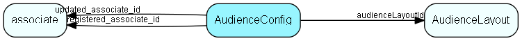

# AudienceConfig Table (236)

Configuration data for Audience core and webparts

## Fields

| Name | Description | Type | Null |
|------|-------------|------|:----:|
|AudienceConfig\_id|Primary key|PK| |
|audienceLayoutId|The name of the installed instance of Audience - must match the web.config file|FK [AudienceLayout](audiencelayout.md)| |
|configName|The name of the configuration parameter|String(239)| |
|configValue|The value of the configuration parameter|String(239)| |
|seqno|Sequence number, for chaining multiple records in case the value is too long|UShort| |
|registered|Registered when|UtcDateTime| |
|registered\_associate\_id|Registered by whom|FK [associate](associate.md)| |
|updated|Last updated when|UtcDateTime| |
|updated\_associate\_id|Last updated by whom|FK [associate](associate.md)| |
|updatedCount|Number of updates made to this record|UShort| |

[!include[details](./includes/audienceconfig.md)]

## Indexes

| Fields | Types | Description |
|--------|-------|-------------|
|AudienceConfig\_id |PK |Clustered, Unique |
|audienceLayoutId |FK |Index |

## Relationships

| Table|  Description |
|------|-------------|
|[associate](associate.md)  |Employees, resources and other users - except for External persons |
|[AudienceLayout](audiencelayout.md)  |One layout (of webparts and other stuff) for an audience instance |

## Replication Flags

* None

## Security Flags

* No access control via user's Role.

