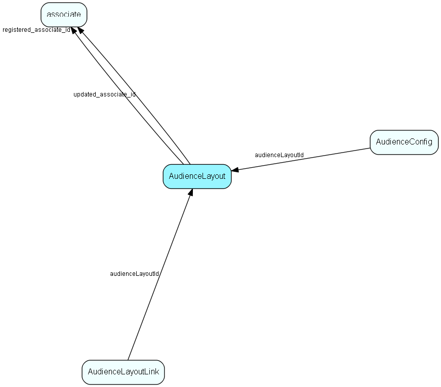

# AudienceLayout Table (234)

One layout (of webparts and other stuff) for an audience instance

## Fields

| Name | Description | Type | Null |
|------|-------------|------|:----:|
|AudienceLayout\_id|Primary key|PK| |
|instanceName|The name of the installed instance of Audience - must match the web.config file|String(239)| |
|instanceLayout|The layout, as a serialized string via the Provider architecture|String(2047)| |
|registered|Registered when|UtcDateTime| |
|registered\_associate\_id|Registered by whom|FK [associate](associate.md)| |
|updated|Last updated when|UtcDateTime| |
|updated\_associate\_id|Last updated by whom|FK [associate](associate.md)| |
|updatedCount|Number of updates made to this record|UShort| |

[!include[details](./includes/audiencelayout.md)]

## Indexes

| Fields | Types | Description |
|--------|-------|-------------|
|AudienceLayout\_id |PK |Clustered, Unique |
|instanceName |String(239) |Unique |

## Relationships

| Table|  Description |
|------|-------------|
|[associate](associate.md)  |Employees, resources and other users - except for External persons |
|[AudienceConfig](audienceconfig.md)  |Configuration data for Audience core and webparts |
|[AudienceLayoutLink](audiencelayoutlink.md)  |Link between an audience layout and some target grouping table - might be Role or Category |

## Replication Flags

* None

## Security Flags

* No access control via user's Role.

