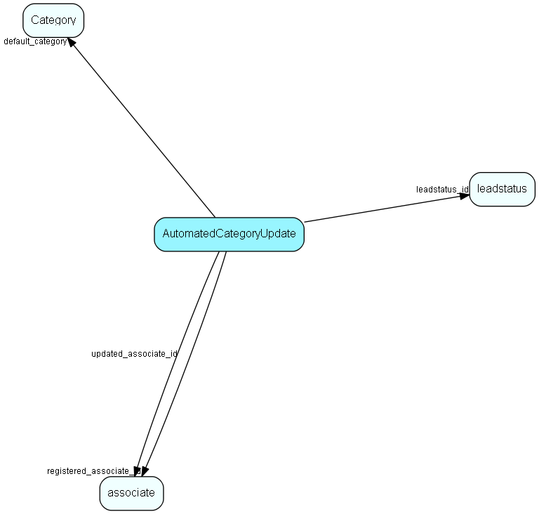

# AutomatedCategoryUpdate Table (541)

Info on how to autoupdate category when changing sale or leadstatus on person

## Fields

| Name | Description | Type | Null |
|------|-------------|------|:----:|
|automatedcategoryupdate\_id|Primary key|PK| |
|trigger\_type|The type of change to trigger the auto update|Enum [CategoryUpdateTrigger](enums/categoryupdatetrigger.md)|&#x25CF;|
|user\_confirmation|Whether to ask the user for confirmation before applying the autoupdate|Bool|&#x25CF;|
|default\_category|The default category id to update to, and the actual new value if no user confirmation is needed|FK [Category](category.md)|&#x25CF;|
|registered|Registered when|UtcDateTime| |
|registered\_associate\_id|Registered by whom|FK [associate](associate.md)| |
|updated|Last updated when|UtcDateTime| |
|updated\_associate\_id|Last updated by whom|FK [associate](associate.md)| |
|updatedCount|Number of updates made to this record|UShort| |
|leadstatus\_id|The leadstatus id to match on person, to trigger autoupdate of category|FK [leadstatus](leadstatus.md)|&#x25CF;|

[!include[details](./includes/automatedcategoryupdate.md)]

## Indexes

| Fields | Types | Description |
|--------|-------|-------------|
|automatedcategoryupdate\_id |PK |Clustered, Unique |
|trigger\_type |Enum |Unique |

## Relationships

| Table|  Description |
|------|-------------|
|[associate](associate.md)  |Employees, resources and other users - except for External persons |
|[Category](category.md)  |Category list table |
|[leadstatus](leadstatus.md)  |List items of lead status that is selectable for contacts and persons that have specific category |

## Replication Flags

* None

## Security Flags

* No access control via user's Role.

