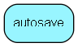

# autosave Table (402)

Autosaved text clobs from ejscript and emarketeer messages

## Fields

| Name | Description | Type | Null |
|------|-------------|------|:----:|
|id|The primary key (auto-incremented)|PK| |
|index\_id|Index id of element that&amp;apos;s autosaved|Int| |
|content\_type|The enum used as identificator|Int| |
|created\_at|When the autosave was saved.|DateTime|&#x25CF;|
|data|The rawtext of the autosave.|Clob|&#x25CF;|

[!include[details](./includes/autosave.md)]

## Indexes

| Fields | Types | Description |
|--------|-------|-------------|
|id |PK |Clustered, Unique |
|index\_id |Int |Index |

## Replication Flags

* None

## Security Flags

* No access control via user's Role.

