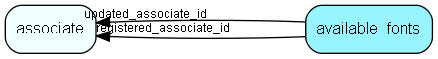

# available\_fonts Table (542)

This table contains all fonts selected to be available for external usage

## Fields

| Name | Description | Type | Null |
|------|-------------|------|:----:|
|available\_fonts\_id|Primary key|PK| |
|display\_name|The display name of the font|String(255)|&#x25CF;|
|font\_family|The font family name|String(255)|&#x25CF;|
|css\_path|The path to the CSS for the font|String(255)|&#x25CF;|
|rank|The rank of the font in the list|Int|&#x25CF;|
|registered|Registered when|UtcDateTime| |
|registered\_associate\_id|Registered by whom|FK [associate](associate.md)| |
|updated|Last updated when|UtcDateTime| |
|updated\_associate\_id|Last updated by whom|FK [associate](associate.md)| |
|updatedCount|Number of updates made to this record|UShort| |

[!include[details](./includes/available-fonts.md)]

## Indexes

| Fields | Types | Description |
|--------|-------|-------------|

## Relationships

| Table|  Description |
|------|-------------|
|[associate](associate.md)  |Employees, resources and other users - except for External persons |

## Replication Flags

* None

## Security Flags

* No access control via user's Role.

