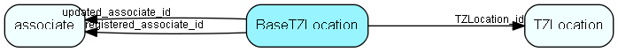

# BaseTZLocation Table (248)

Time zone location for the database (how tz-related datetimes should be stored in the database)

## Fields

| Name | Description | Type | Null |
|------|-------------|------|:----:|
|BaseTZLocation\_id|Primary key|PK| |
|TZLocation\_id|Country that this timezone location is defined for|FK [TZLocation](tzlocation.md)| |
|validFrom|When is this tzLocation valid from, as THE database timezonelocation|DateTime| |
|databaseId|Actually travelcurrent.current_id, the id of the database this basetimezonelocation is meant for|Id| |
|description|Descriptive text|String(254)| |
|registered|Registered when|UtcDateTime| |
|registered\_associate\_id|Registered by whom|FK [associate](associate.md)| |
|updated|Last updated when|UtcDateTime| |
|updated\_associate\_id|Last updated by whom|FK [associate](associate.md)| |
|updatedCount|Number of updates made to this record|UShort| |

[!include[details](./includes/basetzlocation.md)]

## Indexes

| Fields | Types | Description |
|--------|-------|-------------|
|BaseTZLocation\_id |PK |Clustered, Unique |

## Relationships

| Table|  Description |
|------|-------------|
|[associate](associate.md)  |Employees, resources and other users - except for External persons |
|[TZLocation](tzlocation.md)  |Time zone location |

## Replication Flags

* Replicate changes DOWN from central to satellites and travellers.
* Replicate changes UP from satellites and travellers back to central.
* Copy to satellite and travel prototypes.

## Security Flags

* No access control via user's Role.

