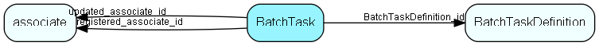

# BatchTask Table (243)

Batch task request details, corresponding to the message body of a batch request message

## Fields

| Name | Description | Type | Null |
|------|-------------|------|:----:|
|BatchTask\_id|Primary key|PK| |
|BatchTaskDefinition\_id|Batch task definition, which is populated from code attributes|FK [BatchTaskDefinition](batchtaskdefinition.md)|&#x25CF;|
|description|Description of task (for monitoring and debugging)|String(254)| |
|dbTag|Database tag that this task applies to, to ensure tasks are execute on the correct database only|String(39)| |
|state|0=Unknown; 1=New; 2=Assigned; 3=Started; 4=Succeeded; 5=Failed|Int| |
|detailsTable|Optional table containing further details that will not fit in the standard request/response fields|TableNumber|&#x25CF;|
|detailsRecord|Optional record containing further details that will not fit in the standard request/response fields|RecordId|&#x25CF;|
|request|The batch request, specifying what to do|String(254)|&#x25CF;|
|response|The response from the batch task processor|String(254)|&#x25CF;|
|startCount|Number of times this batch task has been started (0 for tasks that have never been executed)|Id|&#x25CF;|
|lastStarted|When was this job last started|DateTime|&#x25CF;|
|progressPercent|Task progress, in percent of estimated total|UShort|&#x25CF;|
|progressDescription|Descriptive text for the current stage|String(254)|&#x25CF;|
|registered|Registered when|UtcDateTime| |
|registered\_associate\_id|Registered by whom|FK [associate](associate.md)| |
|updated|&apos;heartbeat&apos; that is updated once a minute by the batch task process|UtcDateTime| |
|updated\_associate\_id|&apos;heartbeat&apos; that is updated once a minute by the batch task process|FK [associate](associate.md)| |
|updatedCount|&apos;heartbeat&apos; that is updated once a minute by the batch task process|UShort| |
|FileName|The filename related to the batchtask.|String(260)|&#x25CF;|

[!include[details](./includes/batchtask.md)]

## Indexes

| Fields | Types | Description |
|--------|-------|-------------|
|BatchTask\_id |PK |Clustered, Unique |
|state |Int |Index |
|BatchTaskDefinition\_id, state |FK, Int |Index |

## Relationships

| Table|  Description |
|------|-------------|
|[associate](associate.md)  |Employees, resources and other users - except for External persons |
|[BatchTaskDefinition](batchtaskdefinition.md)  |Batch task definitiopns, populated from the SuperOffice.CRM.BatchProcessing.BatchTask attribute |

## Replication Flags

* None

## Security Flags

* No access control via user's Role.

