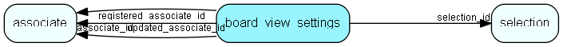

# board\_view\_settings Table (500)

Settings for selection board view

## Fields

| Name | Description | Type | Null |
|------|-------------|------|:----:|
|board\_view\_settings\_id|Primary key|PK| |
|selection\_id|The selection this board view settings belongs to|FK [selection](selection.md)|&#x25CF;|
|associate\_id|The associate this board view settings belongs to (0 for all)|FK [associate](associate.md)|&#x25CF;|
|entity\_type|The kind of board view entity these settings belong to|Enum [BoardViewEntityType](enums/boardviewentitytype.md)|&#x25CF;|
|group\_by|Column name to group on|String(255)|&#x25CF;|
|sub\_group\_by|Column name to group on|String(255)|&#x25CF;|
|sort\_by|Column name to sort on|String(255)|&#x25CF;|
|sort\_desc|True if the sort is descending|Bool|&#x25CF;|
|hide\_empty\_groups|Do not show groups with no members/elements if this is true|Bool|&#x25CF;|
|sum\_by|Column name to sum on|String(255)|&#x25CF;|
|color\_by|Column name to color on|String(255)|&#x25CF;|
|filters|Column names to filter on, comma separated|String(255)|&#x25CF;|
|settings|Settings that are not common to all board views. These are the unique properties of the sub carriers. Stored in json format.|Clob|&#x25CF;|
|registered|Registered when|UtcDateTime| |
|registered\_associate\_id|Registered by whom|FK [associate](associate.md)| |
|updated|Last updated when|UtcDateTime| |
|updated\_associate\_id|Last updated by whom|FK [associate](associate.md)| |
|updatedCount|Number of updates made to this record|UShort| |

[!include[details](./includes/board-view-settings.md)]

## Indexes

| Fields | Types | Description |
|--------|-------|-------------|
|board\_view\_settings\_id |PK |Clustered, Unique |
|selection\_id, associate\_id, entity\_type |FK, FK, Enum |Index |

## Relationships

| Table|  Description |
|------|-------------|
|[associate](associate.md)  |Employees, resources and other users - except for External persons |
|[selection](selection.md)  |Selections |

## Replication Flags

* None

## Security Flags

* No access control via user's Role.

