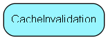

# CacheInvalidation Table (524)

Names and generation numbers for distributed invalidation of caches

## Fields

| Name | Description | Type | Null |
|------|-------------|------|:----:|
|cacheinvalidation\_id|Primary key|PK| |
|Name|The (unique!) name of the cache, which is often, but not always, the same as a physical table name|String(255)|&#x25CF;|
|Generation|The &apos;generation number&apos;, starts at 1 and goes up for every registered change|Int|&#x25CF;|
|LastChange|The UTC datetime of the last change; for information only|UtcDateTime|&#x25CF;|
|LastChangeMachine|The name of the machine where the last change occurred|String(255)|&#x25CF;|
|FirstChange|When was the first flush registered for this table/cache|UtcDateTime|&#x25CF;|

[!include[details](./includes/cacheinvalidation.md)]

## Indexes

| Fields | Types | Description |
|--------|-------|-------------|
|cacheinvalidation\_id |PK |Clustered, Unique |
|Name |String(255) |Unique |

## Replication Flags

* None

## Security Flags

* No access control via user's Role.

