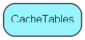

# CacheTables Table (148)

Specifies which tables should be cached to local files (or otherwise), generally these are the lists and other low-frequency-of-change tables. Contains the ID of any tables cached in SOCache. The files are binary and called &lt;tablename&gt;.bin.  &lt;Shift&gt;+&lt;F5&gt; throws all cache files. 

## Fields

| Name | Description | Type | Null |
|------|-------------|------|:----:|
|CacheTabs\_id|Primary key|PK| |
|tableId|ID of table to be cached in local file|TableNumber| |
|subKeyId|Field ID of subkey field|FieldId| |
|subKeyValue|Value of given subkey|Id| |
|checkSum|Checksum after last update of that table|Int| |

[!include[details](./includes/cachetables.md)]

## Indexes

| Fields | Types | Description |
|--------|-------|-------------|
|CacheTabs\_id |PK |Clustered, Unique |
|tableId |TableNumber |Index |

## Replication Flags

* Copy to satellite and travel prototypes.

## Security Flags

* No access control via user's Role.

