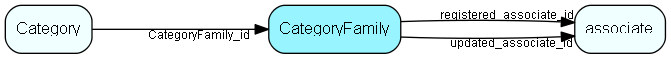

# CategoryFamily Table (473)

Grouping table so that multiple company categories can be grouped under one term; to simplify searching for things like &apos;all customers&apos;

## Fields

| Name | Description | Type | Null |
|------|-------------|------|:----:|
|categoryfamily\_id|Primary key|PK| |
|name|The list item|String(239)| |
|rank|Rank order|UShort|&#x25CF;|
|tooltip|Tooltip or other description|String(254)|&#x25CF;|
|deleted|0 -&gt; record is active 1 -&gt; record is &apos;deleted&apos; and should not be shown in lists|UShort|&#x25CF;|
|registered|Registered when|UtcDateTime| |
|registered\_associate\_id|Registered by whom|FK [associate](associate.md)| |
|updated|Last updated when|UtcDateTime| |
|updated\_associate\_id|Last updated by whom|FK [associate](associate.md)| |
|updatedCount|Number of updates made to this record|UShort| |

[!include[details](./includes/categoryfamily.md)]

## Indexes

| Fields | Types | Description |
|--------|-------|-------------|
|categoryfamily\_id |PK |Clustered, Unique |
|name |String(239) |Unique |

## Relationships

| Table|  Description |
|------|-------------|
|[associate](associate.md)  |Employees, resources and other users - except for External persons |
|[Category](category.md)  |Category list table |

## Replication Flags

* None

## Security Flags

* No access control via user's Role.

