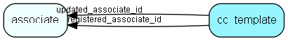

# cc\_template Table (478)

This table contains templates for the customer center

## Fields

| Name | Description | Type | Null |
|------|-------------|------|:----:|
|cc\_template\_id|Primary key|PK| |
|key|The key to this template, normally the local path and filename|String(255)| |
|body|The HTML body for this template|Clob|&#x25CF;|
|type|What kind of template is in this row|Enum [CcTemplateType](enums/cctemplatetype.md)|&#x25CF;|
|registered|Registered when|UtcDateTime| |
|registered\_associate\_id|Registered by whom|FK [associate](associate.md)| |
|updated|Last updated when|UtcDateTime| |
|updated\_associate\_id|Last updated by whom|FK [associate](associate.md)| |
|updatedCount|Number of updates made to this record|UShort| |

[!include[details](./includes/cc-template.md)]

## Indexes

| Fields | Types | Description |
|--------|-------|-------------|
|cc\_template\_id |PK |Clustered, Unique |
|key |String(255) |Index |

## Relationships

| Table|  Description |
|------|-------------|
|[associate](associate.md)  |Employees, resources and other users - except for External persons |

## Replication Flags

* None

## Security Flags

* No access control via user's Role.

