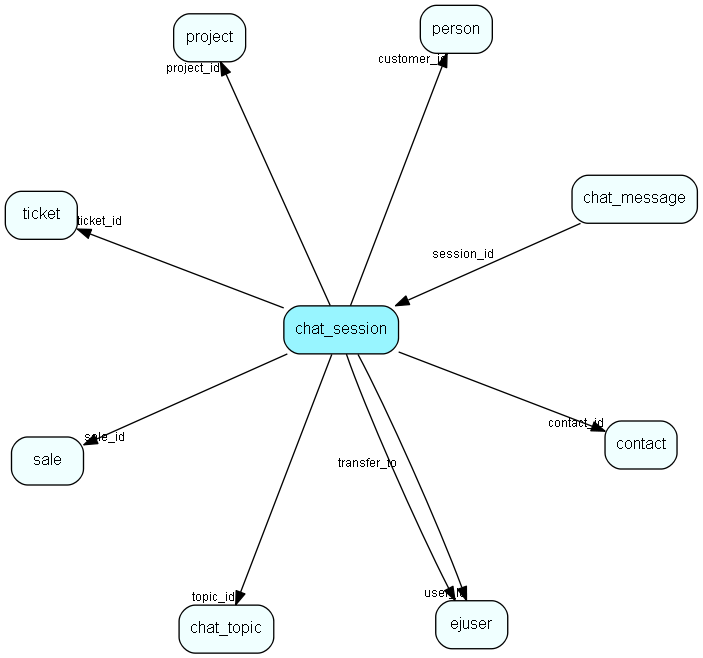

# chat\_session Table (332)

This table contains chat sessions.

## Fields

| Name | Description | Type | Null |
|------|-------------|------|:----:|
|id|The primary key (auto-incremented)|PK| |
|topic\_id|The reference to the associated chat topic.|FK [chat_topic](chat-topic.md)| |
|user\_id|The reference to the associated user.|FK [ejuser](ejuser.md)| |
|customer\_id|The reference to the associated customer. May be NULL or -1.|FK [person](person.md)| |
|customer\_alias|The alias for the customer.|String(64)|&#x25CF;|
|status|Enum indicating the status for the session (pending, active, closed, etc).|Enum [ChatSessionStatus](enums/chatsessionstatus.md)|&#x25CF;|
|when\_requested|When the session was requested by the customer.|DateTime|&#x25CF;|
|when\_started|When the session was accepted by a user.|DateTime|&#x25CF;|
|when\_ended|When the session was ended.|DateTime|&#x25CF;|
|idle|The last time anyone sent a message for this session.|DateTime|&#x25CF;|
|customer\_fetch|The last time the customer&amp;apos;s client refetched the data. Used to detect &amp;apos;dead&amp;apos; session.|DateTime|&#x25CF;|
|session\_key|Key used to authenticate the session.|String(255)|&#x25CF;|
|initial\_queue\_pos|The initial queue pos (i.e. the number of pending sessions + 1) when the session was requested.|Int|&#x25CF;|
|customer\_host|The hostname or IP address for the customer.|String(255)|&#x25CF;|
|alert\_level|The alert level for this chat session.|Int|&#x25CF;|
|rank|Lowest possible unique number for active sessions for user. User for color index. Starting at 1.|Int|&#x25CF;|
|name|The name of customer, if provided|String(255)|&#x25CF;|
|company\_name|The name of the customers company, if provided|String(255)|&#x25CF;|
|email|The email address of the customer, if provided|String(255)|&#x25CF;|
|phone|The phone number of the customer, if provided|String(32)|&#x25CF;|
|first\_message|A copy of the first message in the chat session|String(1024)|&#x25CF;|
|last\_message|A copy of the last message in the chat session|String(1024)|&#x25CF;|
|flags|Various flags for the chat session|Enum [ChatSessionFlags](enums/chatsessionflags.md)|&#x25CF;|
|project\_id|The project that this chat session is connected to|FK [project](project.md)|&#x25CF;|
|sale\_id|The sale that this chat session is connected to|FK [sale](sale.md)|&#x25CF;|
|ticket\_id|The ticket that this chat session is connected to|FK [ticket](ticket.md)|&#x25CF;|
|contact\_id|The contact that this chat session is connected to|FK [contact](contact.md)|&#x25CF;|
|transfer\_to|The ejuser that has a pending transfer of the chat session|FK [ejuser](ejuser.md)|&#x25CF;|
|consented|The customer consented when starting the session|Bool|&#x25CF;|
|chatbot\_isactive|Indicates that a chatbot is active on the session. This will cause bot triggers to fire. Set to 0 when bot hands off to user.|Bool|&#x25CF;|
|country|The country that the chat customer selected.|Int|&#x25CF;|
|rating|Rating of this chat conversation given by the customer|Int|&#x25CF;|

[!include[details](./includes/chat-session.md)]

## Indexes

| Fields | Types | Description |
|--------|-------|-------------|
|id |PK |Clustered, Unique |
|topic\_id |FK |Index |
|user\_id |FK |Index |
|customer\_id |FK |Index |
|status, topic\_id, id |Enum, FK, PK |Index |

## Relationships

| Table|  Description |
|------|-------------|
|[chat\_message](chat-message.md)  |This table contains messages in a chat session. |
|[chat\_topic](chat-topic.md)  |This table contains chat topics. |
|[contact](contact.md)  |Companies and Organizations.   This table features a special record containing information about the contact that owns the database.   |
|[ejuser](ejuser.md)  |This table contains entries for the users of the system. |
|[person](person.md)  |Persons in a company or an organizations. All associates have a corresponding person record |
|[project](project.md)  |Projects |
|[sale](sale.md)  |Sales  For every Sale record edited through the SuperOffice GUI, a copy of the current version of the record will be saved in the SaleHist table. This also applies to editing done through the SaleModel COM interface, but not to editing done through the OLE DB Provider or other channels.   |
|[ticket](ticket.md)  |This table contains the tickets (requests) of the system. Its purpose should be evident. |

## Replication Flags

* None

## Security Flags

* No access control via user's Role.

