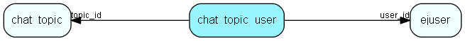

# chat\_topic\_user Table (331)

This table connected the chat topics with the users (i.e. the membership).

## Fields

| Name | Description | Type | Null |
|------|-------------|------|:----:|
|id|The primary key (auto-incremented)|PK| |
|user\_id|The reference to the associated user|FK [ejuser](ejuser.md)| |
|topic\_id|The reference to the associated chat topic.|FK [chat_topic](chat-topic.md)| |
|can\_respond|True if the user can respond to chats in this topic|Bool|&#x25CF;|
|notifications|True if the user should receive notifications for this topic|Bool|&#x25CF;|
|can\_listen|True of a user can listen in on this topic|Bool|&#x25CF;|
|manager|True if the user is a manager for this topic|Bool|&#x25CF;|

[!include[details](./includes/chat-topic-user.md)]

## Indexes

| Fields | Types | Description |
|--------|-------|-------------|
|id |PK |Clustered, Unique |
|user\_id |FK |Index |
|topic\_id |FK |Index |

## Relationships

| Table|  Description |
|------|-------------|
|[chat\_topic](chat-topic.md)  |This table contains chat topics. |
|[ejuser](ejuser.md)  |This table contains entries for the users of the system. |

## Replication Flags

* None

## Security Flags

* No access control via user's Role.

