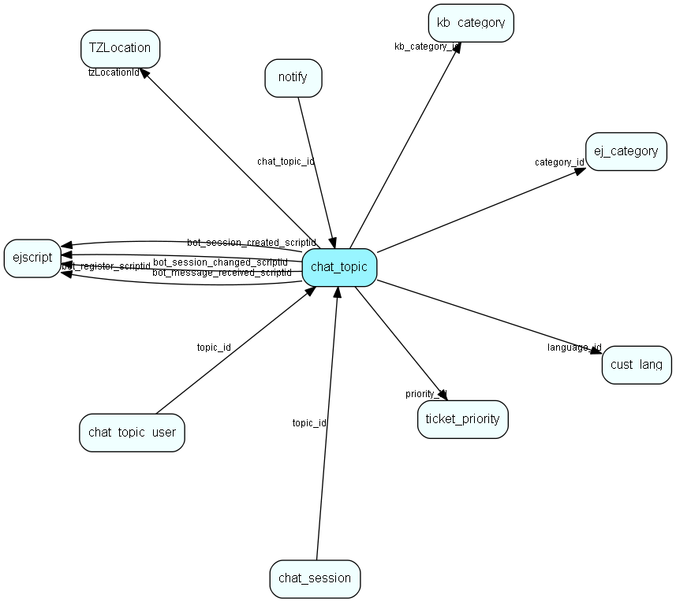

# chat\_topic Table (330)

This table contains chat topics.

## Fields

| Name | Description | Type | Null |
|------|-------------|------|:----:|
|id|The primary key (auto-incremented)|PK| |
|description|The descriptiong for this topic.|String(255)|&#x25CF;|
|language\_id|The reference to the associated customer language. NULL or -1 if not set.|FK [cust_lang](cust-lang.md)|&#x25CF;|
|welcome\_message|The welcome message sent to the customer when the chat session starts.|Clob|&#x25CF;|
|last\_accept|The last time a session was accepted from the inside for this topic.|DateTime|&#x25CF;|
|seconds\_pr\_accept|The average number of seconds per accept for this topic.|Int|&#x25CF;|
|alert\_timeout|The number of seconds for an unanswered session before we alert|Int|&#x25CF;|
|alert\_template|The reply template to use for alerting|Int|&#x25CF;|
|alert\_recipient|The recipient(s) for the alert template|String(255)|&#x25CF;|
|flags|Flags for this topic: show popup alert?, collect consent first?, use custom message?|Enum [ChatTopicFlag](enums/chattopicflag.md)|&#x25CF;|
|name|The name of this chat topic|String(255)|&#x25CF;|
|badge\_header|The badge header of the chat topic|String(255)|&#x25CF;|
|warning\_new\_chat|Contains the user notify time in minutes|Int|&#x25CF;|
|manager\_warning\_new\_chat|Contains the manager notify time in minutes|Int|&#x25CF;|
|widget\_theme|Predefined themes for the chat widget|Enum [WidgetTheme](enums/widgettheme.md)|&#x25CF;|
|widget\_color|The base color of the widget|String(16)|&#x25CF;|
|widget\_font|The font used in the widget|String(64)|&#x25CF;|
|widget\_show\_logo|Indicates if the logo should be shown in the widget|Bool|&#x25CF;|
|widget\_show\_agent\_photo|Use agent photo and name when chatting|Bool|&#x25CF;|
|widget\_welcome\_title|Short welcome message when user initiates a chat|String(255)|&#x25CF;|
|widget\_welcome\_message|Short message displayed as long as the request is in queue or active|String(255)|&#x25CF;|
|widget\_offline\_header|Offline text shown in widget header|String(255)|&#x25CF;|
|widget\_offline\_message|Offline message shown in widget|String(1024)|&#x25CF;|
|widget\_enable\_ticket|Enable ticket submission in offline mode|Bool|&#x25CF;|
|category\_id|Category on ticket created from off-line request|FK [ej_category](ej-category.md)|&#x25CF;|
|priority\_id|Priority on ticket created from off-line request|FK [ticket_priority](ticket-priority.md)|&#x25CF;|
|widget\_offline\_fields|Required field when creating ticket in offline mode|Enum [WidgetRequiredFields](enums/widgetrequiredfields.md)|&#x25CF;|
|widget\_auto\_faq|Enable automatic FAQ suggestions|Bool|&#x25CF;|
|kb\_category\_id|Root folder for FAQ suggestions|FK [kb_category](kb-category.md)|&#x25CF;|
|widget\_pre\_form|Enable pre-chat form for anonymous users|Bool|&#x25CF;|
|widget\_pre\_message|Message to be shown in a pre-chat|String(1024)|&#x25CF;|
|widget\_required\_fields|Fields required to start a chat|Enum [WidgetRequiredFields](enums/widgetrequiredfields.md)|&#x25CF;|
|widget\_post\_form|Enable post chat form|Bool|&#x25CF;|
|widget\_post\_header|Header text to show in post chat form|String(255)|&#x25CF;|
|widget\_post\_message|Message text to show in post chat form|String(1024)|&#x25CF;|
|widget\_post\_transcript|Enable transcript of chat session|Bool|&#x25CF;|
|widget\_language|The language ISO code for the widget language|String(63)|&#x25CF;|
|use\_opening\_hours|Whether to use opening hours or not.|Bool|&#x25CF;|
|tzLocationId|Timezone used for the start/stop times for this topic.|FK [TZLocation](tzlocation.md)|&#x25CF;|
|mon\_enabled|Whether open on Mondays.|Bool|&#x25CF;|
|mon\_start|When opening hours start on Mondays. Only time-part is used.|DateTime|&#x25CF;|
|mon\_stop|When opening hours stop on Mondays. Only time-part is used.|DateTime|&#x25CF;|
|tue\_enabled|Whether open on Tuesdays.|Bool|&#x25CF;|
|tue\_start|When opening hours start on Tuesdays. Only time-part is used.|DateTime|&#x25CF;|
|tue\_stop|When opening hours stop on Tuesdays. Only time-part is used.|DateTime|&#x25CF;|
|wed\_enabled|Whether open on Wednesdays.|Bool|&#x25CF;|
|wed\_start|When opening hours start on Wednesdays. Only time-part is used.|DateTime|&#x25CF;|
|wed\_stop|When opening hours stop on Wednesday. Only time-part is used.|DateTime|&#x25CF;|
|thu\_enabled|Whether open on Thursdays.|Bool|&#x25CF;|
|thu\_start|When opening hours start on Thursdays. Only time-part is used.|DateTime|&#x25CF;|
|thu\_stop|When opening hours stop on Thursdays. Only time-part is used.|DateTime|&#x25CF;|
|fri\_enabled|Whether open on Fridays.|Bool|&#x25CF;|
|fri\_start|When opening hours start on Fridays. Only time-part is used.|DateTime|&#x25CF;|
|fri\_stop|When opening hours stop on Fridays. Only time-part is used.|DateTime|&#x25CF;|
|sat\_enabled|Whether open on Saturdays.|Bool|&#x25CF;|
|sat\_start|When opening hours start on Saturdays. Only time-part is used.|DateTime|&#x25CF;|
|sat\_stop|When opening hours stop on Saturdays. Only time-part is used.|DateTime|&#x25CF;|
|sun\_enabled|Whether open on Sundays.|Bool|&#x25CF;|
|sun\_start|When opening hours start on Sundays. Only time-part is used.|DateTime|&#x25CF;|
|sun\_stop|When opening hours stop on Sundays. Only time-part is used.|DateTime|&#x25CF;|
|custom\_queue\_text|A text to be used in the queue message in the chat widget. Usage is controlled by the flags field, bit number 3|String(255)|&#x25CF;|
|bot\_enabled|Enable chatbot on this topic. Run the trigger scripts on bot events.|Bool|&#x25CF;|
|bot\_name|Chatbot name|String(80)|&#x25CF;|
|bot\_register\_scriptid|Script id to register/unregister chatbot. 0 if there is no bot|FK [ejscript](ejscript.md)|&#x25CF;|
|bot\_session\_created\_scriptid|Script id to run on new session.|FK [ejscript](ejscript.md)|&#x25CF;|
|bot\_session\_changed\_scriptid|Script id to run when session state changes.|FK [ejscript](ejscript.md)|&#x25CF;|
|bot\_message\_received\_scriptid|Script id to run when new messages received from customer.|FK [ejscript](ejscript.md)|&#x25CF;|
|use\_lunch\_hours|Whether to use lunch hours or not.|Bool|&#x25CF;|
|lunch\_start|When opening hours starts for lunch. Only time-part is used.|DateTime|&#x25CF;|
|lunch\_stop|When opening hours stops for lunch. Only time-part is used.|DateTime|&#x25CF;|
|widget\_agent\_use\_firstname|Whether to use the firstname of the agent in the chat widget.|Bool|&#x25CF;|
|warning\_chat\_message|Contains the user notify time in minutes for new chat messages|Int| |
|manager\_warning\_chat\_message|Contains the manager notify time in minutes for new chat messages|Int| |
|offline\_form\_time\_limit|The number of minutes in the queue before the offline form is available|Int|&#x25CF;|
|offline\_form\_queue\_length|The number of customers in the queue before the offline form is available|Int|&#x25CF;|
|widget\_enable\_rating|Setting this to true will enable rating support in the chat widget|Bool|&#x25CF;|
|widget\_rating\_text|The text to be displayed in the widget next to the rating stars|String(1024)|&#x25CF;|
|widget\_badge\_color|Optional color for chat widget badge|String(16)|&#x25CF;|
|widget\_badge\_text\_color|Optional color for chat widget badge text|String(16)|&#x25CF;|
|widget\_cust\_msg\_color|Optional color for chat widget customer message|String(16)|&#x25CF;|
|widget\_cust\_msg\_text\_color|Optional color for chat widget customer message text|String(16)|&#x25CF;|
|widget\_agent\_msg\_color|Optional color for chat widget agent message|String(16)|&#x25CF;|
|widget\_agent\_msg\_text\_color|Optional color for chat widget agent message text|String(16)|&#x25CF;|
|widget\_font\_size|Optional size for chat widget font|String(16)|&#x25CF;|
|widget\_button\_color|Optional color for chat widget button|String(16)|&#x25CF;|
|widget\_button\_text\_color|Optional color for chat widget button text|String(16)|&#x25CF;|

[!include[details](./includes/chat-topic.md)]

## Indexes

| Fields | Types | Description |
|--------|-------|-------------|
|id |PK |Clustered, Unique |
|language\_id |FK |Index |

## Relationships

| Table|  Description |
|------|-------------|
|[chat\_session](chat-session.md)  |This table contains chat sessions. |
|[chat\_topic\_user](chat-topic-user.md)  |This table connected the chat topics with the users (i.e. the membership). |
|[cust\_lang](cust-lang.md)  |This table contains entries for customer languages. |
|[ej\_category](ej-category.md)  |This table contains categories, in which tickets are categorized. The categories are organized in a hierarchial manner. |
|[ejscript](ejscript.md)  |ejscript |
|[kb\_category](kb-category.md)  |Knowledge base folder hierarchy |
|[notify](notify.md)  |This table contains the pop-up messages displayed for users for various events, such as &amp;apos;new ticket&amp;apos;, etc. |
|[ticket\_priority](ticket-priority.md)  |This table contains the ticket priorities. |
|[TZLocation](tzlocation.md)  |Time zone location |

## Replication Flags

* None

## Security Flags

* No access control via user's Role.

