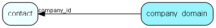

# company\_domain Table (303)

This table contains web-domains associated with a certain cust_company entry.

## Fields

| Name | Description | Type | Null |
|------|-------------|------|:----:|
|id|The primary key (auto-incremented)|PK| |
|company\_id|The cust_company entry this domain is associated with.|FK [contact](contact.md)| |
|domain\_name|The domain. E.g. &amp;apos;www.ejournal.no&amp;apos;, &amp;apos;company.com&amp;apos;, &amp;apos;http://some.domain.net&amp;apos;|String(255)| |
|rank|The rank|Int| |

[!include[details](./includes/company-domain.md)]

## Indexes

| Fields | Types | Description |
|--------|-------|-------------|
|id |PK |Clustered, Unique |
|company\_id |FK |Index |

## Relationships

| Table|  Description |
|------|-------------|
|[contact](contact.md)  |Companies and Organizations.   This table features a special record containing information about the contact that owns the database.   |

## Replication Flags

* None

## Security Flags

* No access control via user's Role.

