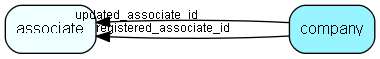

# company Table (1)

Information on license and owner of this SuperOffice database. This table should only have 1 row. This table contains encrypted license information. Changing it will disable login for all users and require you to restore the database from backup.

## Fields

| Name | Description | Type | Null |
|------|-------------|------|:----:|
|company\_id|Primary key|PK| |
|version|Database version, must match dictionary (conceptualdatabase)|Int| |
|revision|Database revision, must match dictionary|UShort| |
|ownerContactName|Name of contact who owns the license - exact match required|String(219)| |
|ownerDepartmentName|Department of contact who owns the license - exact match required|String(219)| |
|ownerContactId|ID of contact who owns the license|Id| |
|dbContactName|Name of contact who owns this database (&lt;&gt; license owner for satellite etc)|String(219)| |
|dbDepartmentName|Department of contact who owns this database|String(219)| |
|dbContactId|ID of contact who owns this database|Id| |
|serialNo|Serial number of license; this is THE master item... which will be checked against SuperOffice AS license database by SoAdmin!|String(219)| |
|extraInfo|Spare field|String(254)|&#x25CF;|
|encryptedCheck|Encrypted hash checksum|String(254)| |
|registered|Registered when|UtcDateTime| |
|registered\_associate\_id|Registered by whom|FK [associate](associate.md)| |
|updated|Last updated when|UtcDateTime| |
|updated\_associate\_id|Last updated by whom|FK [associate](associate.md)| |
|updatedCount|Number of updates made to this record|UShort| |

[!include[details](./includes/company.md)]

## Indexes

| Fields | Types | Description |
|--------|-------|-------------|
|company\_id |PK |Clustered, Unique |

## Relationships

| Table|  Description |
|------|-------------|
|[associate](associate.md)  |Employees, resources and other users - except for External persons |

## Replication Flags

* Replicate changes DOWN from central to satellites and travellers.
* Copy to satellite and travel prototypes.

## Security Flags

* No access control via user's Role.

