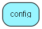

# config Table (255)

This table contains certain system-wide configuration values.

## Fields

| Name | Description | Type | Null |
|------|-------------|------|:----:|
|id|The primary key (auto-incremented)|PK| |
|text\_path|The path to the text-folder containing the emailBackup, trashbin, etc. subfolders.|String(255)|&#x25CF;|
|attachment\_path|The path to the folder containing the attachments.|String(255)|&#x25CF;|
|template\_path|The path to the templates used for the customer front-end.|String(255)|&#x25CF;|
|admin\_mail|The email address to the administrator of the system. E.g. ejournal-admin@company.com.|String(255)|&#x25CF;|
|default\_mail|The default from address in emails being sent from the system. E.g. support@company.com.|String(255)|&#x25CF;|
|panic\_mail|The email address to where error messages are sent. Normally error@superoffice.com.|String(255)|&#x25CF;|
|smtp\_host|The hostname or IP-address of the SMTP server used for sending email.|String(255)|&#x25CF;|
|smtp\_port|The port of the SMTP server used for sending email.|Int| |
|cgi\_bin|The cgi-bin alias used to access the executables through HTTP. E.g. &amp;apos;/bin&amp;apos;|String(255)|&#x25CF;|
|cgi\_url|The base URL to the system. E.g. &amp;apos;http://ejournal.company.com&amp;apos;.|String(255)|&#x25CF;|
|gfx\_url|The base URL to the graphics files.|String(255)|&#x25CF;|
|warning|The path + leading filename for the warning logfiles.|String(255)|&#x25CF;|
|tag|The tag used as ticket id identificator in the subject of emails.|String(32)|&#x25CF;|
|mailheader|The default header used (i.e. line 1) in outbound email.|String(255)|&#x25CF;|
|autologout|The number of minutes if idle time before a user is logged ut. A zero value means no autologout.|Int|&#x25CF;|
|simautologout|The number of minutes if idle time before a simultaneus user is logged ut. A zero value means no autologout.|Int|&#x25CF;|
|flags|A bitmask of flags controlling various options.|Int|&#x25CF;|
|debug\_flags|A default bitmask of flags controlling debug logging.|Int|&#x25CF;|
|language|The systemlanguage. &amp;apos;no&amp;apos; or &amp;apos;en&amp;apos;.|String(5)|&#x25CF;|
|mb\_max\_value|This is the upper (initial) value for the spam-control algorithm, which makes sure that a single email address does not recieve too many emails.|Int|&#x25CF;|
|mb\_threshold|This is the treshold value for the spam-contol algorithm. When the value for a given email address is below this value, emails will be blocked.|Int|&#x25CF;|
|mb\_modifier|This is the &amp;apos;cost&amp;apos; of sending an email, which is subtracted from the mb-value for the given email address. The mb-value is increased with 1 every second.|Int|&#x25CF;|
|version|The version of the installed software.|String(32)|&#x25CF;|
|installed\_at|The timestamp of when the system was installed, or last upgraded.|DateTime|&#x25CF;|
|installed\_by|Whoever installed the software.|String(255)|&#x25CF;|
|unique\_id|An ID that should be unique for all eJournal installations.|String(32)|&#x25CF;|
|cgi\_url\_internal|The internal base URL to the system. E.g. &amp;apos;http://ejournal.company.com&amp;apos;.|String(255)|&#x25CF;|
|temp\_license|Temporary license key created for this session.|String(255)|&#x25CF;|
|feature\_toggle|Temporary values used for feature toggles|Clob|&#x25CF;|

[!include[details](./includes/config.md)]

## Indexes

| Fields | Types | Description |
|--------|-------|-------------|
|id |PK |Clustered, Unique |

## Replication Flags

* None

## Security Flags

* No access control via user's Role.

