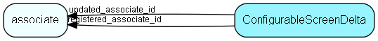

# ConfigurableScreenDelta Table (464)

Parts of recipes in SCIL to insert or remove in given recipes

## Fields

| Name | Description | Type | Null |
|------|-------------|------|:----:|
|configurablescreendelta\_id|Primary key|PK| |
|name|The name of this delta|String(255)|&#x25CF;|
|description|The description of this delta|String(1024)|&#x25CF;|
|recipeId|The recipe in scil where this delta will be merged|String(255)|&#x25CF;|
|deltaType|Type of delta lik webpanel, but also system, customized.|Enum [DeltaType](enums/deltatype.md)|&#x25CF;|
|deltaJson|String with the delta to merge into the SCIL recipe|Clob|&#x25CF;|
|appliesTo|String on this strict form: &apos;X &lt;tablename&gt;&lt;id&gt; &lt;tablename&gt;&lt;id&gt; X&apos; Like X role8 X|String(4000)|&#x25CF;|
|registered|Registered when|UtcDateTime| |
|registered\_associate\_id|Registered by whom|FK [associate](associate.md)| |
|updated|Last updated when|UtcDateTime| |
|updated\_associate\_id|Last updated by whom|FK [associate](associate.md)| |
|updatedCount|Number of updates made to this record|UShort| |
|deltaState|State of the delta, like draft or published|Enum [DeltaState](enums/deltastate.md)|&#x25CF;|

[!include[details](./includes/configurablescreendelta.md)]

## Indexes

| Fields | Types | Description |
|--------|-------|-------------|
|configurablescreendelta\_id |PK |Clustered, Unique |
|recipeId |String(255) |Index |

## Relationships

| Table|  Description |
|------|-------------|
|[associate](associate.md)  |Employees, resources and other users - except for External persons |

## Replication Flags

* None

## Security Flags

* No access control via user's Role.

