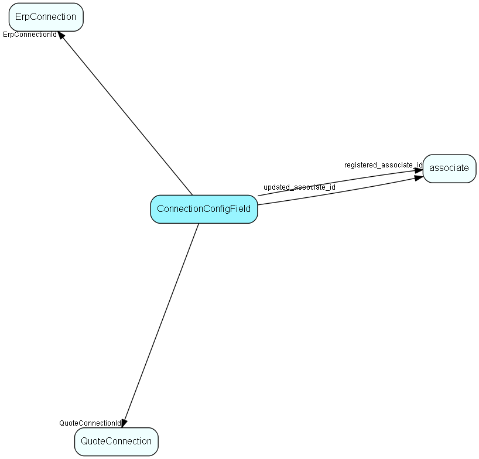

# ConnectionConfigField Table (421)

Configuration data for Erp and Quote Connections

## Fields

| Name | Description | Type | Null |
|------|-------------|------|:----:|
|connectionconfigfield\_id|Primary key|PK| |
|ErpConnectionId|Erp connection, if this row belongs to an ERP Connector|FK [ErpConnection](erpconnection.md)|&#x25CF;|
|QuoteConnectionId|Quote connection, if this row belongs to a Quote Connector|FK [QuoteConnection](quoteconnection.md)|&#x25CF;|
|FieldKey|The key that identifies the field, taken from the connector&apos;s metadata|String(254)|&#x25CF;|
|FieldValue|The field value, formatted for transport as a string using CultureDataFormatter|String(1023)|&#x25CF;|
|registered|Registered when|UtcDateTime| |
|registered\_associate\_id|Registered by whom|FK [associate](associate.md)| |
|updated|Last updated when|UtcDateTime| |
|updated\_associate\_id|Last updated by whom|FK [associate](associate.md)| |
|updatedCount|Number of updates made to this record|UShort| |

[!include[details](./includes/connectionconfigfield.md)]

## Indexes

| Fields | Types | Description |
|--------|-------|-------------|
|connectionconfigfield\_id |PK |Clustered, Unique |
|ErpConnectionId |FK |Index |
|QuoteConnectionId |FK |Index |

## Relationships

| Table|  Description |
|------|-------------|
|[associate](associate.md)  |Employees, resources and other users - except for External persons |
|[ErpConnection](erpconnection.md)  |One connection to an ERP connector, specifying Client and other required information |
|[QuoteConnection](quoteconnection.md)  |Primary key in the CRM database. Definition of a connection to an external system, for the Quote system. |

## Replication Flags

* None

## Security Flags

* No access control via user's Role.

