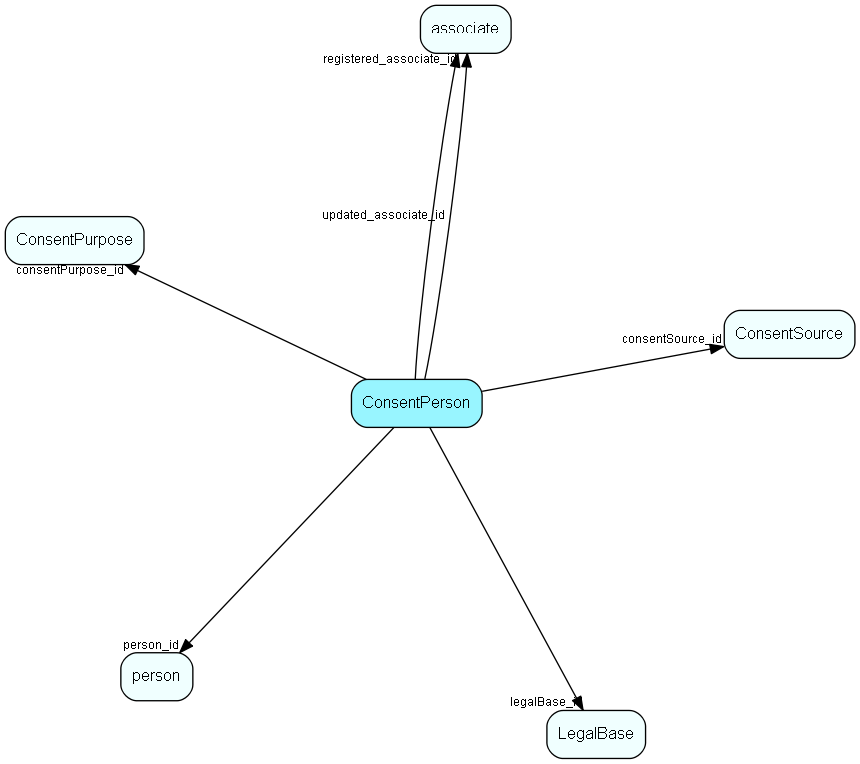

# ConsentPerson Table (472)

Link table that defines who has which consents

## Fields

| Name | Description | Type | Null |
|------|-------------|------|:----:|
|consentperson\_id|Primary key|PK| |
|person\_id|Person who gave consent|FK [person](person.md)|&#x25CF;|
|consentPurpose\_id|Legal base|FK [ConsentPurpose](consentpurpose.md)|&#x25CF;|
|legalBase\_id|Legal base|FK [LegalBase](legalbase.md)|&#x25CF;|
|consentSource\_id|Consent source|FK [ConsentSource](consentsource.md)|&#x25CF;|
|comment|A comment describing why this GDPR change was made|String(255)|&#x25CF;|
|registered|Registered when|UtcDateTime| |
|registered\_associate\_id|Registered by whom|FK [associate](associate.md)| |
|updated|Last updated when|UtcDateTime| |
|updated\_associate\_id|Last updated by whom|FK [associate](associate.md)| |
|updatedCount|Number of updates made to this record|UShort| |

[!include[details](./includes/consentperson.md)]

## Indexes

| Fields | Types | Description |
|--------|-------|-------------|
|consentperson\_id |PK |Clustered, Unique |
|legalBase\_id |FK |Index |
|consentSource\_id |FK |Index |
|person\_id, consentPurpose\_id |FK, FK |Unique |

## Relationships

| Table|  Description |
|------|-------------|
|[associate](associate.md)  |Employees, resources and other users - except for External persons |
|[ConsentPurpose](consentpurpose.md)  |GDPR purpose alternatives |
|[ConsentSource](consentsource.md)  |Consent source for GDPR |
|[LegalBase](legalbase.md)  |Legal base for GDPR (Article 6) |
|[person](person.md)  |Persons in a company or an organizations. All associates have a corresponding person record |

## Replication Flags

* Area Management controlled table. Contents replicated to satellites and traveller databases.
* Replicate changes UP from satellites and travellers back to central.
* Copy to satellite and travel prototypes.

## Security Flags

* No access control via user's Role.

