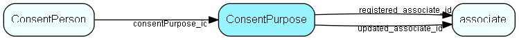

# ConsentPurpose Table (469)

GDPR purpose alternatives

## Fields

| Name | Description | Type | Null |
|------|-------------|------|:----:|
|consentpurpose\_id|Primary key|PK| |
|name|The name of this purpose|String(4000)|&#x25CF;|
|rank|Rank order|UShort|&#x25CF;|
|tooltip|List item tooltip|String(4000)|&#x25CF;|
|deleted|0 -&gt; record is active 1 -&gt; record is &apos;deleted&apos; and should not be shown in lists|UShort|&#x25CF;|
|key|The key used to refer to this purpose, like #Process, #Emarketing etc.|String(255)|&#x25CF;|
|consentText|Form text used for the actual checkbox|String(4000)|&#x25CF;|
|formText|Text for the consent form, the long text to be shown when asking the end-user for this kind of consent|Clob|&#x25CF;|
|privacyStatementDesc|A heading or description of the privacy text|String(4000)|&#x25CF;|
|privacyStatementUrl|Url referencing the actual privacy statement text; may have different urls for different languages|String(4000)|&#x25CF;|
|active|True if this consent purpose is active|Bool|&#x25CF;|
|registered|Registered when|UtcDateTime| |
|registered\_associate\_id|Registered by whom|FK [associate](associate.md)| |
|updated|Last updated when|UtcDateTime| |
|updated\_associate\_id|Last updated by whom|FK [associate](associate.md)| |
|updatedCount|Number of updates made to this record|UShort| |

[!include[details](./includes/consentpurpose.md)]

## Indexes

| Fields | Types | Description |
|--------|-------|-------------|
|consentpurpose\_id |PK |Clustered, Unique |
|name |String(4000) |Unique |
|key |String(255) |Unique |

## Relationships

| Table|  Description |
|------|-------------|
|[associate](associate.md)  |Employees, resources and other users - except for External persons |
|[ConsentPerson](consentperson.md)  |Link table that defines who has which consents |

## Replication Flags

* Replicate changes DOWN from central to satellites and travellers.
* Replicate changes UP from satellites and travellers back to central.
* Copy to satellite and travel prototypes.

## Security Flags

* No access control via user's Role.

