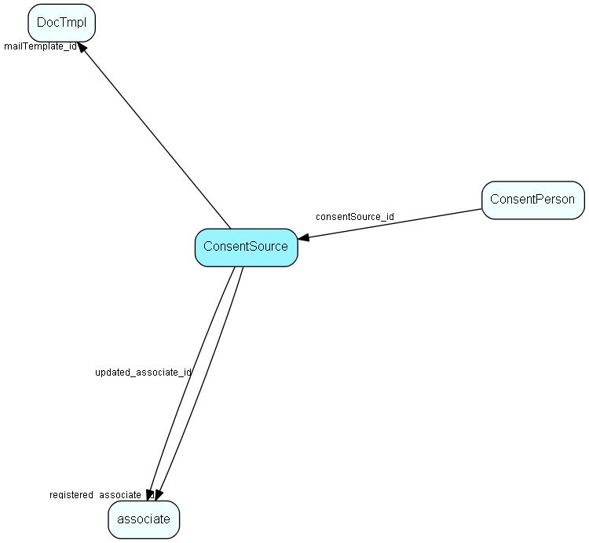

# ConsentSource Table (471)

Consent source for GDPR

## Fields

| Name | Description | Type | Null |
|------|-------------|------|:----:|
|consentsource\_id|Primary key|PK| |
|name|The list item|String(4000)| |
|rank|Rank order|UShort|&#x25CF;|
|tooltip|The tooltip for the list item|String(4000)|&#x25CF;|
|deleted|0 -&gt; record is active 1 -&gt; record is &apos;deleted&apos; and should not be shown in lists|UShort|&#x25CF;|
|key|The list item key, to be recognized by application logic|String(255)|&#x25CF;|
|mailTemplate\_id|The document template to be used for sending &apos;You have been added to our system, is this ok&apos; emails when a new person is registered using this source|FK [DocTmpl](doctmpl.md)|&#x25CF;|
|registered|Registered when|UtcDateTime| |
|registered\_associate\_id|Registered by whom|FK [associate](associate.md)| |
|updated|Last updated when|UtcDateTime| |
|updated\_associate\_id|Last updated by whom|FK [associate](associate.md)| |
|updatedCount|Number of updates made to this record|UShort| |

[!include[details](./includes/consentsource.md)]

## Indexes

| Fields | Types | Description |
|--------|-------|-------------|
|consentsource\_id |PK |Clustered, Unique |
|key |String(255) |Unique |

## Relationships

| Table|  Description |
|------|-------------|
|[associate](associate.md)  |Employees, resources and other users - except for External persons |
|[ConsentPerson](consentperson.md)  |Link table that defines who has which consents |
|[DocTmpl](doctmpl.md)  |DocTmpl list table. Describes templates available for writing new documents. |

## Replication Flags

* Replicate changes DOWN from central to satellites and travellers.
* Replicate changes UP from satellites and travellers back to central.
* Copy to satellite and travel prototypes.

## Security Flags

* No access control via user's Role.

