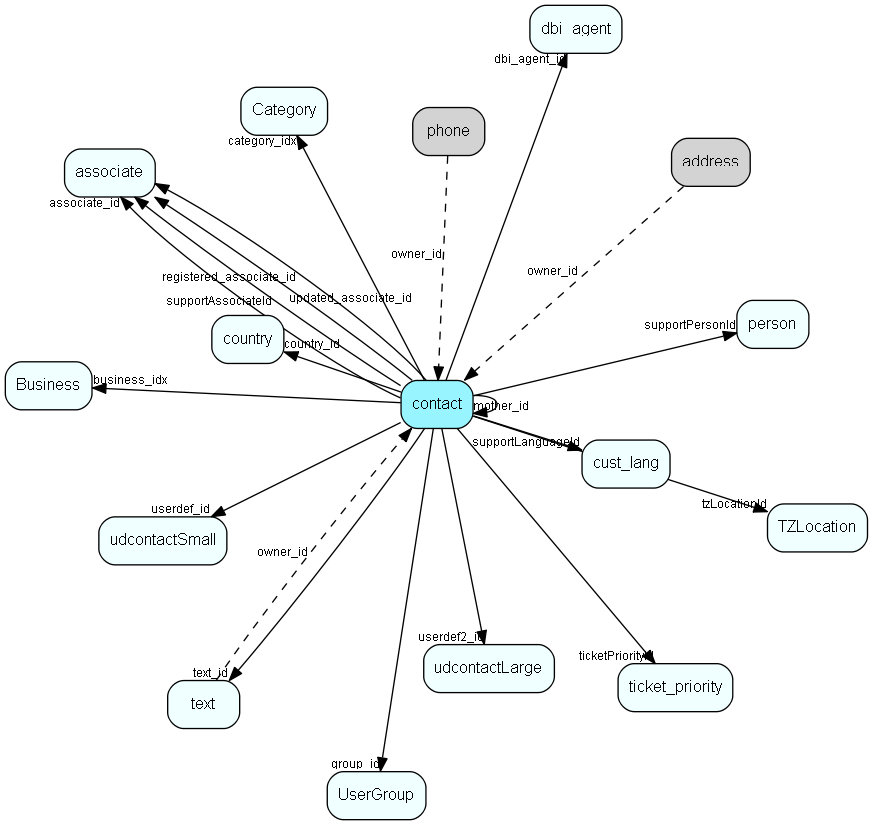

# contact Table (5)

Companies and Organizations.   This table features a special record containing information about the contact that owns the database.  

## Fields

| Name | Description | Type | Null |
|------|-------------|------|:----:|
|contact\_id|Primary key|PK| |
|name|Contact name|String(219)| |
|kananame|Contact kana name, used in Japanese versions only|String(219)|&#x25CF;|
|department|Department|String(219)|&#x25CF;|
|number1|Alphanumeric user field|String(49)|&#x25CF;|
|number2|Alphanumeric user field|String(49)|&#x25CF;|
|associate\_id|Our contact|FK [associate](associate.md)|&#x25CF;|
|country\_id|Country|FK [country](country.md)| |
|business\_idx|Link to Business|FK [Business](business.md)| |
|category\_idx|Link to Category|FK [Category](category.md)| |
|xstop|STOP flag|Bool|&#x25CF;|
|nomailing|No mailings flags|Bool|&#x25CF;|
|registered|Date registered|UtcDateTime| |
|registered\_associate\_id|Registered by whom|FK [associate](associate.md)| |
|updated|Date last updated|UtcDateTime| |
|updated\_associate\_id|Last updated by whom|FK [associate](associate.md)| |
|text\_id|Paperclip note|FK [text](text.md)|&#x25CF;|
|mother\_id|Reserved|FK [contact](contact.md)|&#x25CF;|
|userdef\_id|User defined table record 1|FK [udcontactSmall](udcontactsmall.md)|&#x25CF;|
|orgNr|VAT number or similar|String(49)|&#x25CF;|
|soundEx|What the name sounds like, for duplicate detection|String(9)|&#x25CF;|
|source|How did we get this contact? For future integration needs|UShort|&#x25CF;|
|userdef2\_id|User defined table record 2|FK [udcontactLarge](udcontactlarge.md)|&#x25CF;|
|activeInterests|Number of records in cintr table; select count(*) from cintr ci where ci.contact_id = this.contact_id == activeInterests is always true|UShort|&#x25CF;|
|updatedCount|Number of times updated|UShort| |
|group\_id|Group id of original owning associate, semantics like appnt.grp_id|FK [UserGroup](usergroup.md)|&#x25CF;|
|tzLocationId|Default timezone location for this contact|FK [TZLocation](tzlocation.md)|&#x25CF;|
|ticketPriorityId|Default ticket priority for new tickets|FK [ticket_priority](ticket-priority.md)|&#x25CF;|
|deleted|If nonzero, then this contact is &apos;deleted&apos; and should generally not be shown|UShort|&#x25CF;|
|supportLanguageId|Customers language (does not necessarily map to ISO languages)|FK [cust_lang](cust-lang.md)|&#x25CF;|
|supportAssociateId|Our contact, but for support context, not sales/primary contact|FK [associate](associate.md)|&#x25CF;|
|supportPersonId|The person (at the customer) who support talks to (the counterpart of supportAssociateId)|FK [person](person.md)|&#x25CF;|
|dbi\_agent\_id|Integration agent (eJournal)|FK [dbi_agent](dbi-agent.md)|&#x25CF;|
|dbi\_key|The primary key for the integrated entry in the external datasource.|String(255)|&#x25CF;|
|dbi\_last\_syncronized|Last external syncronization.|DateTime|&#x25CF;|
|dbi\_last\_modified|When the entry was last modified.|DateTime|&#x25CF;|
|activeErpLinks|The number of Erp Sync connections this record is synced with; count of the ErpExternalKey+ErpInternalKey relations|Int|&#x25CF;|
|DeletedDate|Datetime (utc) when this record was soft-deleted; if this value is set then the record should not be shown|UtcDateTime|&#x25CF;|

[!include[details](./includes/contact.md)]

## Indexes

| Fields | Types | Description |
|--------|-------|-------------|
|contact\_id |PK |Clustered, Unique |
|name |String(219) |Index |
|kananame |String(219) |Index |
|department |String(219) |Index |
|number1 |String(49) |Index |
|number2 |String(49) |Index |
|business\_idx |FK |Index |
|category\_idx |FK |Index |
|mother\_id |FK |Index |
|userdef\_id |FK |Index |
|orgNr |String(49) |Index |
|soundEx |String(9) |Index |
|source |UShort |Index |
|userdef2\_id |FK |Index |
|dbi\_agent\_id |FK |Index |
|dbi\_key |String(255) |Index |
|dbi\_last\_syncronized |DateTime |Index |
|dbi\_last\_modified |DateTime |Index |
|name, department |String(219), String(219) |Index |
|DeletedDate |UtcDateTime |Index |
|supportPersonId |FK |Index |

## Relationships

| Table|  Description |
|------|-------------|
|[address](address.md)  |Contact and Person addresses |
|[appointment](appointment.md)  |Tasks, appointments, followups, phone calls; and documents (document_id != 0). An appointment always has a corresponding record in VisibleFor specifying who may see this.  |
|[associate](associate.md)  |Employees, resources and other users - except for External persons |
|[Business](business.md)  |Business list table |
|[Category](category.md)  |Category list table |
|[chat\_session](chat-session.md)  |This table contains chat sessions. |
|[company\_domain](company-domain.md)  |This table contains web-domains associated with a certain cust_company entry. |
|[contact](contact.md)  |Companies and Organizations.   This table features a special record containing information about the contact that owns the database.   |
|[contactinterest](contactinterest.md)  |Link-table between contact and interests in ContInt |
|[CounterValue](countervalue.md)  |Visible for rights |
|[country](country.md)  |Country information |
|[cust\_lang](cust-lang.md)  |This table contains entries for customer languages. |
|[dbi\_agent](dbi-agent.md)  |DBI agent settings |
|[Email](email.md)  |Email addresses for contacts, projects and persons |
|[email\_item](email-item.md)  |Email data |
|[form\_submission](form-submission.md)  |A form submission |
|[freetextindex](freetextindex.md)  |This is the index table for the free text search function. Each word in FreeTextWords can have multiple occurrences in this table. Each record in this table points to one occurrence of the word, and points to both the table in which the word occurs (which might be contact or text), and also a pointer to the owner table (which is one of contact, person, project, appointment or sale).  |
|[invoice](invoice.md)  |This table contains invoice entries, normally created when an invoice is sent to a customer, and we want to update the balance. |
|[invoice\_sum](invoice-sum.md)  |This table is used temporarily when listing invoice statistics. It is used because we need to sort balances from both customers and companies. |
|[OwnerContactLink](ownercontactlink.md)  |Table specifying which contacts can own associates.  All contacts that have rows in this table (i.e. rows with contact_id pointing to them) will be offered as associate owners in the maintenance client and as candidate Satellite owners. Such contacts have restrictions on editing and deletion to protect database consistency.  |
|[person](person.md)  |Persons in a company or an organizations. All associates have a corresponding person record |
|[phone](phone.md)  |Contact and Person phonenumbers (+fax) |
|[projectmember](projectmember.md)  |Project members. Link-table between person and project |
|[s\_shipment\_addr](s-shipment-addr.md)  |Addresses that are ready to be sent in a shipment. |
|[sale](sale.md)  |Sales  For every Sale record edited through the SuperOffice GUI, a copy of the current version of the record will be saved in the SaleHist table. This also applies to editing done through the SaleModel COM interface, but not to editing done through the OLE DB Provider or other channels.   |
|[SaleHist](salehist.md)  |Mirror image of the Sale table, providing a full transaction history. Every time you edit a sale, the current record of the sale is also saved here.  |
|[SaleStakeholder](salestakeholder.md)  |Stakeholders in the sale, very similar to project members |
|[satellite](satellite.md)  |Definition of Satellites |
|[selectionmember](selectionmember.md)  |Selection detail table  Each row in a selection is represented by one record in this table. Contact_id is always filled in, person_id is optional, but if used, must point to a person belonging to the contact in contact_id. |
|[StatusValue](statusvalue.md)  |Values for statuses |
|[target\_assignment\_info](target-assignment-info.md)  |Linking associate, company or user group target and other information with target values |
|[target\_revision\_history](target-revision-history.md)  |Revision history info in case the original target group or assignment info was deleted |
|[text](text.md)  |Long text fields from all over the system |
|[ticket](ticket.md)  |This table contains the tickets (requests) of the system. Its purpose should be evident. |
|[ticket\_priority](ticket-priority.md)  |This table contains the ticket priorities. |
|[TZLocation](tzlocation.md)  |Time zone location |
|[udcontactLarge](udcontactlarge.md)  |User-defined fields for contact (long strings) |
|[udcontactSmall](udcontactsmall.md)  |User-defined fields for contact |
|[URL](url.md)  |Unified Resource Locators, URL to contacts, persons or projects. |
|[UserGroup](usergroup.md)  |Secondary user groups |
|[workflow\_instance](workflow-instance.md)  |A set of properties related to the workflow instance of one participant going through the flow |

## Replication Flags

* Area Management controlled table. Contents replicated to satellites and traveller databases.
* Replicate changes UP from satellites and travellers back to central.
* Copy to satellite and travel prototypes.
* Cache table during filtering.

## Security Flags

* Sentry controls access to items in this table using user's Role and data rights matrix.

