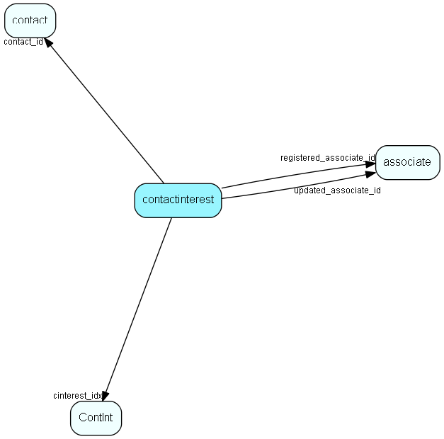

# contactinterest Table (14)

Link-table between contact and interests in ContInt

## Fields

| Name | Description | Type | Null |
|------|-------------|------|:----:|
|contactinterest\_id|Primary key|PK| |
|contact\_id|Owning contact|FK [contact](contact.md)| |
|cinterest\_idx|Contact interest link|FK [ContInt](contint.md)| |
|startDate|Start date for this interest - no GUI|DateTime|&#x25CF;|
|endDate|End date for this interest - no GUI|DateTime|&#x25CF;|
|flags|Spare flag field|UInt|&#x25CF;|
|registered|Registered when|UtcDateTime| |
|registered\_associate\_id|Registered by whom|FK [associate](associate.md)| |
|updated|Last updated when|UtcDateTime| |
|updated\_associate\_id|Last updated by whom|FK [associate](associate.md)| |
|updatedCount|Number of updates made to this record|UShort| |

[!include[details](./includes/contactinterest.md)]

## Indexes

| Fields | Types | Description |
|--------|-------|-------------|
|contactinterest\_id |PK |Unique |
|cinterest\_idx |FK |Index |
|startDate |DateTime |Index |
|endDate |DateTime |Index |
|contact\_id, cinterest\_idx |FK, FK |Unique |
|contact\_id |FK |Clustered |

## Relationships

| Table|  Description |
|------|-------------|
|[associate](associate.md)  |Employees, resources and other users - except for External persons |
|[contact](contact.md)  |Companies and Organizations.   This table features a special record containing information about the contact that owns the database.   |
|[ContInt](contint.md)  |ContInt list table. List-text of all valid contact interest types. |

## Replication Flags

* Area Management controlled table. Contents replicated to satellites and traveller databases.
* Replicate changes UP from satellites and travellers back to central.
* Copy to satellite and travel prototypes.

## Security Flags

* Sentry controls access to items in this table using user's Role and data rights matrix on the table's parent.

