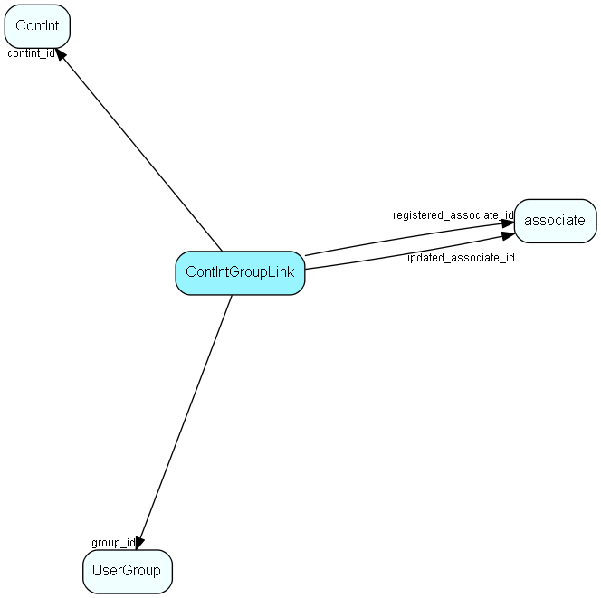

# ContIntGroupLink Table (71)

User group link table for ContInt, for MDO item hiding

## Fields

| Name | Description | Type | Null |
|------|-------------|------|:----:|
|contintgrouplink\_id|Primary key|PK| |
|contint\_id|Link to ContInt list table|FK [ContInt](contint.md)| |
|group\_id|Link to Group table|FK [UserGroup](usergroup.md)| |
|registered|Registered when|UtcDateTime| |
|registered\_associate\_id|Registered by whom|FK [associate](associate.md)| |
|updated|Last updated when|UtcDateTime| |
|updated\_associate\_id|Last updated by whom|FK [associate](associate.md)| |
|updatedCount|Number of updates made to this record|UShort| |

[!include[details](./includes/contintgrouplink.md)]

## Indexes

| Fields | Types | Description |
|--------|-------|-------------|
|contintgrouplink\_id |PK |Clustered, Unique |
|contint\_id |FK |Index |
|group\_id |FK |Index |

## Relationships

| Table|  Description |
|------|-------------|
|[associate](associate.md)  |Employees, resources and other users - except for External persons |
|[ContInt](contint.md)  |ContInt list table. List-text of all valid contact interest types. |
|[UserGroup](usergroup.md)  |Secondary user groups |

## Replication Flags

* Replicate changes DOWN from central to satellites and travellers.
* Replicate changes UP from satellites and travellers back to central.
* Copy to satellite and travel prototypes.

## Security Flags

* No access control via user's Role.

