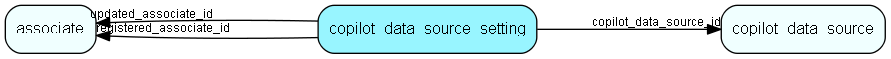

# copilot\_data\_source\_setting Table (476)

Stores specific configuration values for each data source

## Fields

| Name | Description | Type | Null |
|------|-------------|------|:----:|
|copilot\_data\_source\_setting\_id|Primary key|PK| |
|key|The key of data source setting|String(100)| |
|value|The value of data source setting|String(4000)| |
|copilot\_data\_source\_id|The associated copilot data source|FK [copilot_data_source](copilot-data-source.md)| |
|registered|Registered when|UtcDateTime| |
|registered\_associate\_id|Registered by whom|FK [associate](associate.md)| |
|updated|Last updated when|UtcDateTime| |
|updated\_associate\_id|Last updated by whom|FK [associate](associate.md)| |
|updatedCount|Number of updates made to this record|UShort| |

[!include[details](./includes/copilot-data-source-setting.md)]

## Indexes

| Fields | Types | Description |
|--------|-------|-------------|
|copilot\_data\_source\_setting\_id |PK |Clustered, Unique |

## Relationships

| Table|  Description |
|------|-------------|
|[associate](associate.md)  |Employees, resources and other users - except for External persons |
|[copilot\_data\_source](copilot-data-source.md)  |Stores data sources for each copilot |

## Replication Flags

* None

## Security Flags

* No access control via user's Role.

