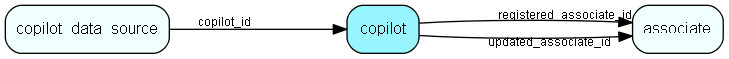

# copilot Table (474)

Contains all available copilots

## Fields

| Name | Description | Type | Null |
|------|-------------|------|:----:|
|copilot\_id|Primary key|PK| |
|name|The name of copilot|String(4000)| |
|registered|Registered when|UtcDateTime| |
|registered\_associate\_id|Registered by whom|FK [associate](associate.md)| |
|updated|Last updated when|UtcDateTime| |
|updated\_associate\_id|Last updated by whom|FK [associate](associate.md)| |
|updatedCount|Number of updates made to this record|UShort| |

[!include[details](./includes/copilot.md)]

## Indexes

| Fields | Types | Description |
|--------|-------|-------------|
|copilot\_id |PK |Clustered, Unique |

## Relationships

| Table|  Description |
|------|-------------|
|[associate](associate.md)  |Employees, resources and other users - except for External persons |
|[copilot\_data\_source](copilot-data-source.md)  |Stores data sources for each copilot |

## Replication Flags

* None

## Security Flags

* No access control via user's Role.

