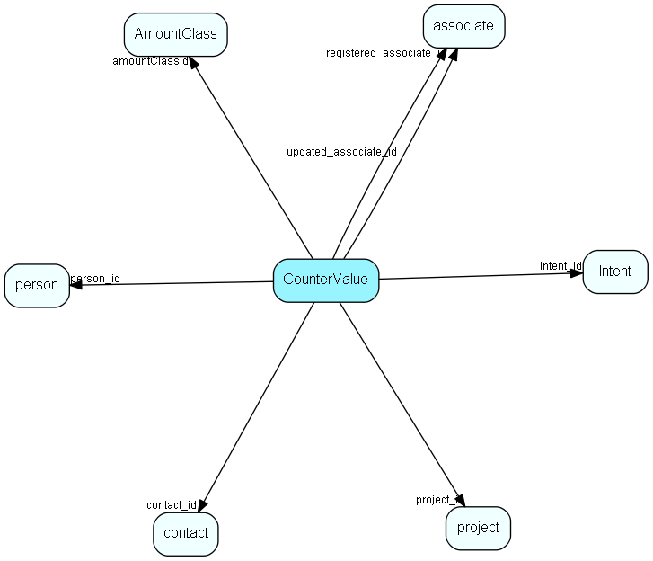

# CounterValue Table (197)

Visible for rights

## Fields

| Name | Description | Type | Null |
|------|-------------|------|:----:|
|CounterValue\_id|Primary key|PK| |
|contact\_id|Link to contact, 0 if this counter is not for contacts|FK [contact](contact.md)| |
|person\_id|Link to person, 0 if this counter is not for person (always 0 in 6.0)|FK [person](person.md)| |
|project\_id|Link to project, 0 if this counter is not for project|FK [project](project.md)| |
|extra1\_id|Spare ID for future links|Id| |
|extra2\_id|Spare ID for future links|Id| |
|record\_type|Same as task.record_type: 1 = app, 2 = doc, 3 = email, 4 = fax, 5 = phone, 6 = todo - see EAppntRecordTypes|Enum [AppntRecordType](enums/appntrecordtype.md)| |
|direction|Same as task.direction: Direction: 0 = none, 1 = incoming, 2 = outgoing|Enum [AppntDirection](enums/appntdirection.md)| |
|intent\_id|Link to Intent list|FK [Intent](intent.md)| |
|sale\_status|Sale status: 0 = Unknown, 1 = open, 2 = closed, 3 = lost, 4 = all sales|Enum [SaleStatus](enums/salestatus.md)| |
|amountClassId|Sale amount class, for splitting sale counters by amounts|FK [AmountClass](amountclass.md)| |
|totalReg|Total registered records of this type|UInt| |
|totalRegInPeriod|Total registered records of this type in the first period (there are up to three period definitions)|UInt| |
|notCompleted|Total records with status Not Completed|UInt| |
|notCompletedInPeriod|Total records with status Not Completed in the first period (there are up to three period definitions)|UInt| |
|lastRegistered|ActiveDate/SaleDate/CreatedAt of last activity/sale/ticket of this type|DateTime|&#x25CF;|
|lastCompleted|ActiveDate/SaleDate/CreatedAt of last COMPLETED activity/sale/ticket of this type|DateTime|&#x25CF;|
|lastDoBy|ActiveDate/SaleDate/CreatedAt of last NOT COMPLETED activity/sale/ticket of this type|DateTime|&#x25CF;|
|extra1\_count|Total registered records of this type in the second period (there are up to three period definitions)|UInt|&#x25CF;|
|extra2\_count|Total records with status Not Completed in the second period (there are up to three period definitions)|UInt|&#x25CF;|
|extra3\_count|Total registered records of this type in the third period (there are up to three period definitions)|UInt|&#x25CF;|
|extra4\_count|Total records with status Not Completed in the third period (there are up to three period definitions)|UInt|&#x25CF;|
|registered|Registered when|UtcDateTime| |
|registered\_associate\_id|Registered by whom|FK [associate](associate.md)| |
|updated|Last updated when|UtcDateTime| |
|updated\_associate\_id|Last updated by whom|FK [associate](associate.md)| |
|updatedCount|Number of updates made to this record|UShort| |

[!include[details](./includes/countervalue.md)]

## Indexes

| Fields | Types | Description |
|--------|-------|-------------|
|CounterValue\_id |PK |Clustered, Unique |
|contact\_id, record\_type |FK, Enum |Index |
|contact\_id, sale\_status |FK, Enum |Index |
|project\_id, record\_type |FK, Enum |Index |
|project\_id, sale\_status |FK, Enum |Index |
|record\_type, direction, intent\_id |Enum, Enum, FK |Index |
|sale\_status, amountClassId |Enum, FK |Index |

## Relationships

| Table|  Description |
|------|-------------|
|[AmountClass](amountclass.md)  |Amount Class list for SuperOffice Sales Intelligence (Saint) - used to group sales by amounts, into bins (low --&gt; high) called amount classes. More information regarding SuperOffice Sales Intelligence on http://techdoc.superoffice.com  |
|[associate](associate.md)  |Employees, resources and other users - except for External persons |
|[contact](contact.md)  |Companies and Organizations.   This table features a special record containing information about the contact that owns the database.   |
|[Intent](intent.md)  |Intent list for SAINT. More information regarding SuperOffice Sales Intelligence on http://techdoc.superoffice.com  |
|[person](person.md)  |Persons in a company or an organizations. All associates have a corresponding person record |
|[project](project.md)  |Projects |

## Replication Flags

* None

## Security Flags

* No access control via user's Role.

