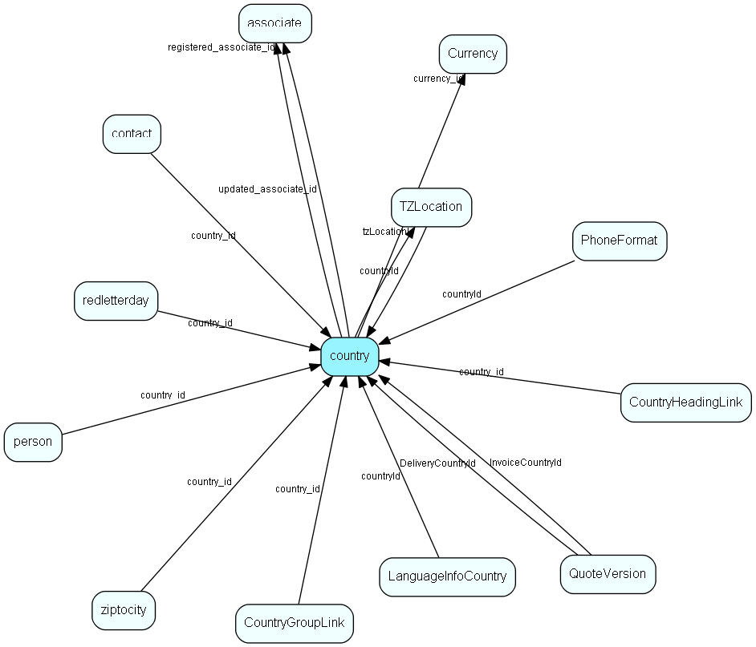

# country Table (19)

country MDO list item table.
Country information

## Fields

| Name | Description | Type | Null |
|------|-------------|------|:----:|
|country\_id|Primary key|PK| |
|name|Name of country in installed language|String(239)| |
|rank|Rank order |UShort|&#x25CF;|
|tooltip|Tooltip or other description|String(254)|&#x25CF;|
|deleted|0 -&gt; record is active 1 -&gt; record is &apos;deleted&apos; and should not be shown in lists|UShort|&#x25CF;|
|english\_name|Name of country in english|String(39)|&#x25CF;|
|zip\_prefix|N- DK- etc.|String(5)|&#x25CF;|
|flagres\_id|Resource ID of flag graphic|UInt|&#x25CF;|
|addressLayout|Points to address format used in the GUI|Id| |
|addressLayoutDomestic|Points to address format used for labels to own country|Id| |
|addressLayoutForeign|Points to address format used for labels to other countries than own country|Id| |
|currency\_id|Default currency for this country|FK [Currency](currency.md)|&#x25CF;|
|orgNrText|Lead text for organisation field|String(254)|&#x25CF;|
|domainName|Default Web domain identifier (.no, .uk, etc; but without the dot)|String(9)|&#x25CF;|
|registered|Registered when|UtcDateTime| |
|registered\_associate\_id|Registered by whom|FK [associate](associate.md)| |
|updated|Last updated when|UtcDateTime| |
|updated\_associate\_id|Last updated by whom|FK [associate](associate.md)| |
|updatedCount|Number of updates made to this record|UShort| |
|defaultLcid|LCID code in .NET, this should be the defaultLcid of the language that has the isDefault flag set in the LanguageInforCountry link table|UInt|&#x25CF;|
|dialInPrefix|Prefix for dialing into the country from outside (country code)|String(31)|&#x25CF;|
|dialOutPrefix|Prefix for dialling out of the country, voice call|String(31)|&#x25CF;|
|interAreaPrefix|Prefix for inter-area dialling in the country|String(31)|&#x25CF;|
|customPhoneDesc|Custom phone description, if any (comes from ISO/ITU documents)|String(254)|&#x25CF;|
|phonePartOfNA|Is the phone system part of the North American system|Bool|&#x25CF;|
|isBuiltIn|Is this record populated by SuperOffice priming data?|Bool|&#x25CF;|
|isoNumber|The primary key used by ISO to identify countries when they have a revolution and change their name from Upper Volta to Burkina Faso :-)|UInt|&#x25CF;|
|abbrev3|ISO 3-letter abbreviation|String(3)|&#x25CF;|
|abbrev2|ISO 2-letter abbreviation|String(2)|&#x25CF;|
|tzLocationId|Default timezone location for this country|FK [TZLocation](tzlocation.md)|&#x25CF;|

[!include[details](./includes/country.md)]

## Indexes

| Fields | Types | Description |
|--------|-------|-------------|
|country\_id |PK |Clustered, Unique |
|name |String(239) |Unique |
|english\_name |String(39) |Index |

## Relationships

| Table|  Description |
|------|-------------|
|[associate](associate.md)  |Employees, resources and other users - except for External persons |
|[contact](contact.md)  |Companies and Organizations.   This table features a special record containing information about the contact that owns the database.   |
|[CountryGroupLink](countrygrouplink.md)  |User group link table for Country, for MDO item hiding |
|[CountryHeadingLink](countryheadinglink.md)  |Heading link table for Country, for MDO headers |
|[Currency](currency.md)  |Currency list table |
|[LanguageInfoCountry](languageinfocountry.md)  |Many-many link between countries and languages, to give intelligent choices for language |
|[person](person.md)  |Persons in a company or an organizations. All associates have a corresponding person record |
|[PhoneFormat](phoneformat.md)  |Formatting information for telephone numbers |
|[QuoteVersion](quoteversion.md)  |There may be multiple Versions of a Quote, with one of them active |
|[redletterday](redletterday.md)  |Red letter days for calendar (holidays, birthday of king etc) |
|[TZLocation](tzlocation.md)  |Time zone location |
|[ziptocity](ziptocity.md)  |Zip codes and city names. Zip codes used during address entry. You will find more information about addressformat on http://techdoc.superoffice.com  |

## Replication Flags

* Replicate changes DOWN from central to satellites and travellers.
* Copy to satellite and travel prototypes.

## Security Flags

* No access control via user's Role.

