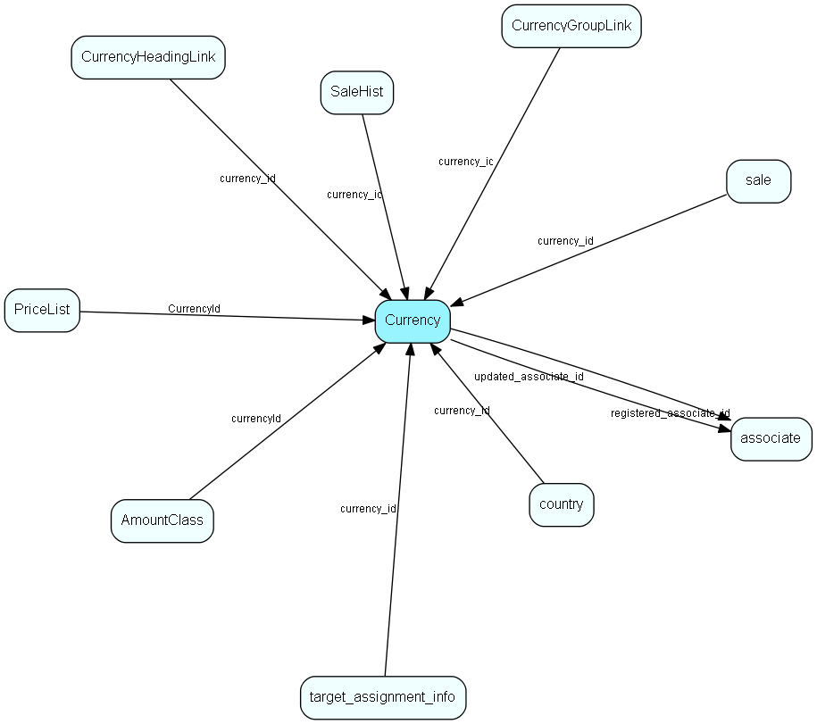

# Currency Table (112)

Currency MDO list item table.
Currency list table

## Fields

| Name | Description | Type | Null |
|------|-------------|------|:----:|
|Currency\_id|Primary key|PK| |
|name|The list item|String(239)| |
|rank|Rank order|UShort|&#x25CF;|
|tooltip|Tooltip or other description|String(254)|&#x25CF;|
|deleted|0 -&gt; record is active 1 -&gt; record is &apos;deleted&apos; and should not be shown in lists|UShort|&#x25CF;|
|rate|Exchange rate|Double| |
|units|Exchange unit scale (0.01, 0.1, 1, 10, 100 etc)|Double| |
|registered|Registered when|UtcDateTime| |
|registered\_associate\_id|Registered by whom|FK [associate](associate.md)| |
|updated|Last updated when|UtcDateTime| |
|updated\_associate\_id|Last updated by whom|FK [associate](associate.md)| |
|updatedCount|Number of updates made to this record|UShort| |
|isoCode|ISO currency code, see http://www.xe.com/iso4217.php|String(9)|&#x25CF;|

[!include[details](./includes/currency.md)]

## Indexes

| Fields | Types | Description |
|--------|-------|-------------|
|Currency\_id |PK |Clustered, Unique |
|name |String(239) |Unique |

## Relationships

| Table|  Description |
|------|-------------|
|[AmountClass](amountclass.md)  |Amount Class list for SuperOffice Sales Intelligence (Saint) - used to group sales by amounts, into bins (low --&gt; high) called amount classes. More information regarding SuperOffice Sales Intelligence on http://techdoc.superoffice.com  |
|[associate](associate.md)  |Employees, resources and other users - except for External persons |
|[country](country.md)  |Country information |
|[CurrencyGroupLink](currencygrouplink.md)  |User group link table for Currency, for MDO item hiding |
|[CurrencyHeadingLink](currencyheadinglink.md)  |Heading link table for Currency, for MDO headers |
|[PriceList](pricelist.md)  |List of prices, cached from an ERP system |
|[sale](sale.md)  |Sales  For every Sale record edited through the SuperOffice GUI, a copy of the current version of the record will be saved in the SaleHist table. This also applies to editing done through the SaleModel COM interface, but not to editing done through the OLE DB Provider or other channels.   |
|[SaleHist](salehist.md)  |Mirror image of the Sale table, providing a full transaction history. Every time you edit a sale, the current record of the sale is also saved here.  |
|[target\_assignment\_info](target-assignment-info.md)  |Linking associate, company or user group target and other information with target values |

## Replication Flags

* Replicate changes DOWN from central to satellites and travellers.
* Replicate changes UP from satellites and travellers back to central.
* Copy to satellite and travel prototypes.

## Security Flags

* No access control via user's Role.

