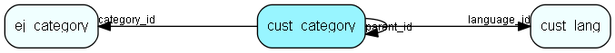

# cust\_category Table (321)

This table contains entries for categories exposed through a customer language.

## Fields

| Name | Description | Type | Null |
|------|-------------|------|:----:|
|id|The primary key (auto-incremented)|PK| |
|name|The external name for this category.|String(255)|&#x25CF;|
|language\_id|The reference to the associated customer language.|FK [cust_lang](cust-lang.md)|&#x25CF;|
|category\_id|The reference to the associated category.|FK [ej_category](ej-category.md)|&#x25CF;|
|parent\_id|The parent category for this cust_category. -1 if this is a toplevel cust_category.|FK [cust_category](cust-category.md)|&#x25CF;|
|fullname|The fullname (compiled from parents&amp;apos; names) for this category. E.g. &amp;apos;norway/product A/support&amp;apos;.|String(255)|&#x25CF;|

[!include[details](./includes/cust-category.md)]

## Indexes

| Fields | Types | Description |
|--------|-------|-------------|
|id |PK |Clustered, Unique |
|language\_id |FK |Index |
|category\_id |FK |Index |
|parent\_id |FK |Index |

## Relationships

| Table|  Description |
|------|-------------|
|[cust\_category](cust-category.md)  |This table contains entries for categories exposed through a customer language. |
|[cust\_lang](cust-lang.md)  |This table contains entries for customer languages. |
|[ej\_category](ej-category.md)  |This table contains categories, in which tickets are categorized. The categories are organized in a hierarchial manner. |

## Replication Flags

* None

## Security Flags

* No access control via user's Role.

