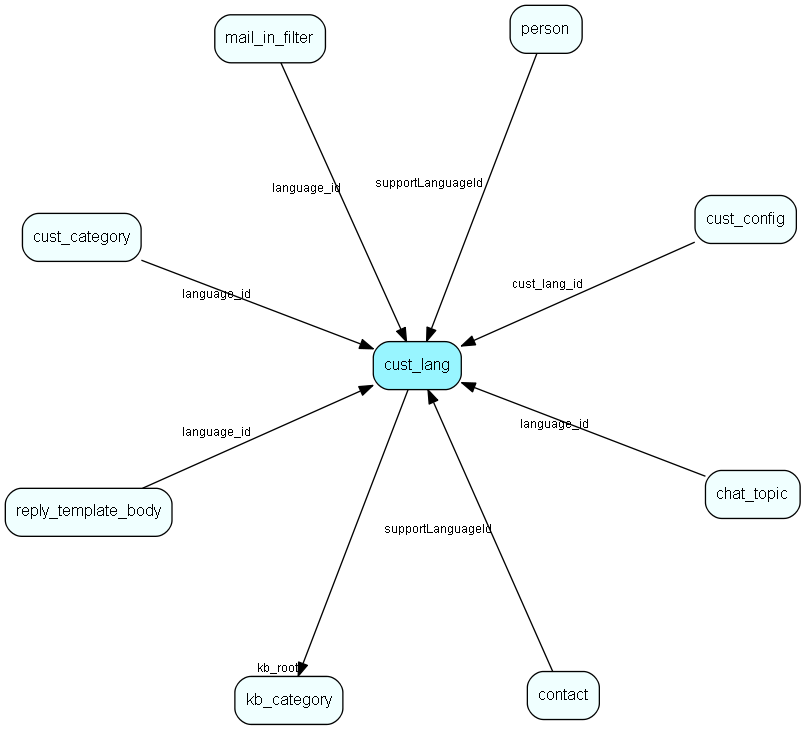

# cust\_lang Table (320)

This table contains entries for customer languages.

## Fields

| Name | Description | Type | Null |
|------|-------------|------|:----:|
|id|The primary key (auto-incremented)|PK| |
|name|The name/alias for this language.|String(255)|&#x25CF;|
|lang\_code|A short code for this language (&amp;apos;no&amp;apos;, &amp;apos;dk&amp;apos;, etc). Used in pathname to templates.|String(5)|&#x25CF;|
|virtual\_domain|The virtual domain which should trigger this language (e.g. &amp;apos;support.company.dk&amp;apos; vs. &amp;apos;support.company.uk&amp;apos;)|String(255)|&#x25CF;|
|web\_domains|The domains from where the user should originate (when surfing) in order to trigger this language. Commaseparated list.|String(255)|&#x25CF;|
|email\_domains|Commaseparated list of toplevel domains from where an email should originate in order to trigger this language.|String(255)|&#x25CF;|
|email\_header|The email header line for this language (&amp;apos;Please keep the subject in any replies...&amp;apos;).|String(255)|&#x25CF;|
|kb\_root|The reference to the FAQ category which is the root category for this language (for separating the FAQ per language).|FK [kb_category](kb-category.md)|&#x25CF;|
|is\_default|Bool indicating whether this language is the default (fallback) language.|Bool|&#x25CF;|
|iso\_code|A two letter iso code for this customer language|String(63)|&#x25CF;|

[!include[details](./includes/cust-lang.md)]

## Indexes

| Fields | Types | Description |
|--------|-------|-------------|
|id |PK |Clustered, Unique |
|kb\_root |FK |Index |

## Relationships

| Table|  Description |
|------|-------------|
|[chat\_topic](chat-topic.md)  |This table contains chat topics. |
|[contact](contact.md)  |Companies and Organizations.   This table features a special record containing information about the contact that owns the database.   |
|[cust\_category](cust-category.md)  |This table contains entries for categories exposed through a customer language. |
|[cust\_config](cust-config.md)  |This table contains JSON structures used for customizing the customer center |
|[kb\_category](kb-category.md)  |Knowledge base folder hierarchy |
|[mail\_in\_filter](mail-in-filter.md)  |This table contains entries for the mailboxes the eJournal system is fetching mail from (POP3 or IMAP). |
|[person](person.md)  |Persons in a company or an organizations. All associates have a corresponding person record |
|[reply\_template\_body](reply-template-body.md)  |Contains the body of the reply templates in different languages |

## Replication Flags

* None

## Security Flags

* No access control via user's Role.

