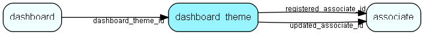

# dashboard\_theme Table (480)

A set of style rules for the Dashboard

## Fields

| Name | Description | Type | Null |
|------|-------------|------|:----:|
|dashboard\_theme\_id|Primary key|PK| |
|name|The name of this theme|String(4000)|&#x25CF;|
|config|The JSON clob-formatted config|Clob|&#x25CF;|
|registered|Registered when|UtcDateTime| |
|registered\_associate\_id|Registered by whom|FK [associate](associate.md)| |
|updated|Last updated when|UtcDateTime| |
|updated\_associate\_id|Last updated by whom|FK [associate](associate.md)| |
|updatedCount|Number of updates made to this record|UShort| |
|rank|Rank order|UShort|&#x25CF;|
|client|Name of client(s) this theme is available to|String(255)|&#x25CF;|
|isBuiltIn|Is this row populated by SuperOffice?|Bool|&#x25CF;|
|style|Style value - for example &apos;light&apos; or &apos;dark&apos;|String(255)|&#x25CF;|

[!include[details](./includes/dashboard-theme.md)]

## Indexes

| Fields | Types | Description |
|--------|-------|-------------|
|dashboard\_theme\_id |PK |Clustered, Unique |

## Relationships

| Table|  Description |
|------|-------------|
|[associate](associate.md)  |Employees, resources and other users - except for External persons |
|[dashboard](dashboard.md)  |Describes a dashboard |

## Replication Flags

* None

## Security Flags

* No access control via user's Role.

