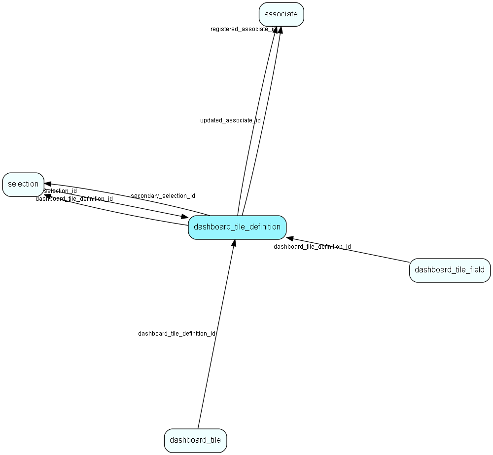

# dashboard\_tile\_definition Table (481)

Describes the contents of a tile

## Fields

| Name | Description | Type | Null |
|------|-------------|------|:----:|
|dashboard\_tile\_definition\_id|Primary key|PK| |
|name|The name of the tile|String(4000)|&#x25CF;|
|description|Detailed description|String(4000)|&#x25CF;|
|default\_width|Default width when added to a dashboard|Int|&#x25CF;|
|default\_height|Default height when added to a dashboard|Int|&#x25CF;|
|tile\_type|Dashboard tile type|Enum [DashTileType](enums/dashtiletype.md)|&#x25CF;|
|entity\_type|Dashboard entity type|Enum [DashTileEntityType](enums/dashtileentitytype.md)|&#x25CF;|
|registered|Registered when|UtcDateTime| |
|registered\_associate\_id|Registered by whom|FK [associate](associate.md)| |
|updated|Last updated when|UtcDateTime| |
|updated\_associate\_id|Last updated by whom|FK [associate](associate.md)| |
|updatedCount|Number of updates made to this record|UShort| |
|selection\_id|Selection holding the criterias for the tile definition|FK [selection](selection.md)|&#x25CF;|
|currency\_mode|Dashboard currency mode|Enum [DashTileCurrencyMode](enums/dashtilecurrencymode.md)|&#x25CF;|
|sort\_by|Sort by field|String(255)|&#x25CF;|
|measure|Dashboard measure type (Count, Sum, Avg, etc.)|Enum [DashTileMeasure](enums/dashtilemeasure.md)|&#x25CF;|
|measure\_field|Field to be measured|String(255)|&#x25CF;|
|secondary\_selection\_id|Selection holding the replaced or changed criterias (period comparisons etc)|FK [selection](selection.md)|&#x25CF;|
|layout\_config|The JSON formatted layout config|Clob|&#x25CF;|
|entity\_name|The entity measured by this tile, defines what provider to use|String(255)|&#x25CF;|
|measure\_by\_field|Field to group by|String(255)|&#x25CF;|
|currency\_code|Currency code|String(3)|&#x25CF;|
|usage|Where this tile can be used|Enum [DashTileUsage](enums/dashtileusage.md)|&#x25CF;|

[!include[details](./includes/dashboard-tile-definition.md)]

## Indexes

| Fields | Types | Description |
|--------|-------|-------------|
|dashboard\_tile\_definition\_id |PK |Clustered, Unique |
|entity\_type |Enum |Index |

## Relationships

| Table|  Description |
|------|-------------|
|[associate](associate.md)  |Employees, resources and other users - except for External persons |
|[dashboard\_tile](dashboard-tile.md)  |Represents one tile in the dashboard |
|[dashboard\_tile\_field](dashboard-tile-field.md)  |Describes the contents of a tile field |
|[selection](selection.md)  |Selections |

## Replication Flags

* None

## Security Flags

* Sentry controls access to items in this table using user's Role and data rights matrix on the table's parent.

