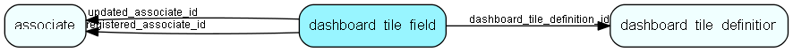

# dashboard\_tile\_field Table (483)

Describes the contents of a tile field

## Fields

| Name | Description | Type | Null |
|------|-------------|------|:----:|
|dashboard\_tile\_field\_id|Primary key|PK| |
|colname|Column to be fetched from provider, can be aggregate like Sum() or CurrencyConvert() or even nested aggregate functions|String(512)|&#x25CF;|
|dashboard\_tile\_definition\_id|Link to dashboard tile definition|FK [dashboard_tile_definition](dashboard-tile-definition.md)|&#x25CF;|
|registered|Registered when|UtcDateTime| |
|registered\_associate\_id|Registered by whom|FK [associate](associate.md)| |
|updated|Last updated when|UtcDateTime| |
|updated\_associate\_id|Last updated by whom|FK [associate](associate.md)| |
|updatedCount|Number of updates made to this record|UShort| |

[!include[details](./includes/dashboard-tile-field.md)]

## Indexes

| Fields | Types | Description |
|--------|-------|-------------|
|dashboard\_tile\_field\_id |PK |Clustered, Unique |
|dashboard\_tile\_definition\_id |FK |Index |

## Relationships

| Table|  Description |
|------|-------------|
|[associate](associate.md)  |Employees, resources and other users - except for External persons |
|[dashboard\_tile\_definition](dashboard-tile-definition.md)  |Describes the contents of a tile |

## Replication Flags

* None

## Security Flags

* No access control via user's Role.

