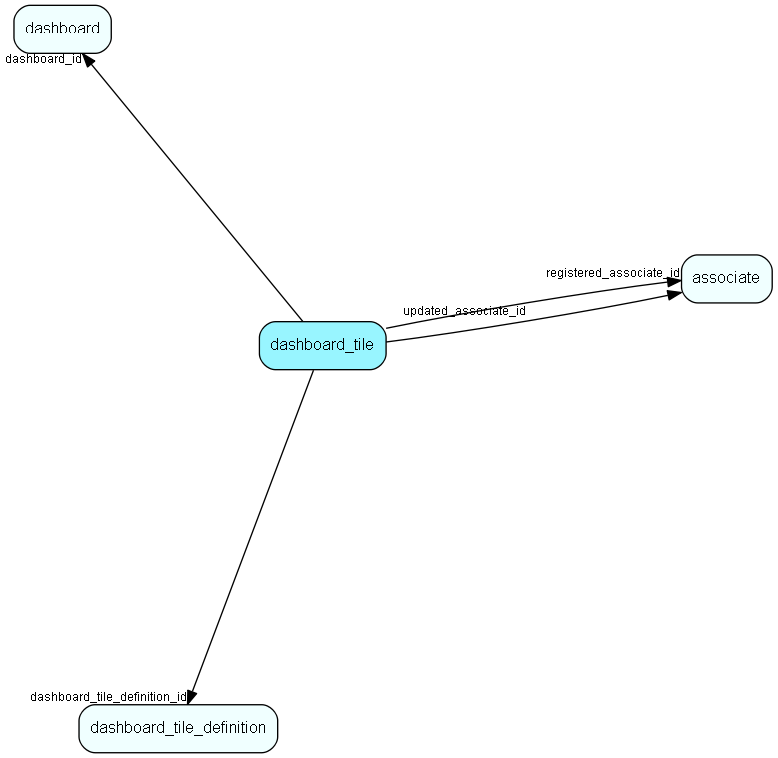

# dashboard\_tile Table (482)

Represents one tile in the dashboard

## Fields

| Name | Description | Type | Null |
|------|-------------|------|:----:|
|dashboard\_tile\_id|Primary key|PK| |
|width|Width used by this tile in the dashboard|Int|&#x25CF;|
|height|Height used by this tile in the dashboard|Int|&#x25CF;|
|dashboard\_id|The associated dashboard|FK [dashboard](dashboard.md)|&#x25CF;|
|dashboard\_tile\_definition\_id|The associated tile definition|FK [dashboard_tile_definition](dashboard-tile-definition.md)|&#x25CF;|
|registered|Registered when|UtcDateTime| |
|registered\_associate\_id|Registered by whom|FK [associate](associate.md)| |
|updated|Last updated when|UtcDateTime| |
|updated\_associate\_id|Last updated by whom|FK [associate](associate.md)| |
|updatedCount|Number of updates made to this record|UShort| |
|rank|Rank order|UShort|&#x25CF;|

[!include[details](./includes/dashboard-tile.md)]

## Indexes

| Fields | Types | Description |
|--------|-------|-------------|
|dashboard\_tile\_id |PK |Clustered, Unique |
|dashboard\_id |FK |Index |

## Relationships

| Table|  Description |
|------|-------------|
|[associate](associate.md)  |Employees, resources and other users - except for External persons |
|[dashboard](dashboard.md)  |Describes a dashboard |
|[dashboard\_tile\_definition](dashboard-tile-definition.md)  |Describes the contents of a tile |

## Replication Flags

* None

## Security Flags

* Sentry controls access to items in this table using user's Role and data rights matrix on the table's parent.

