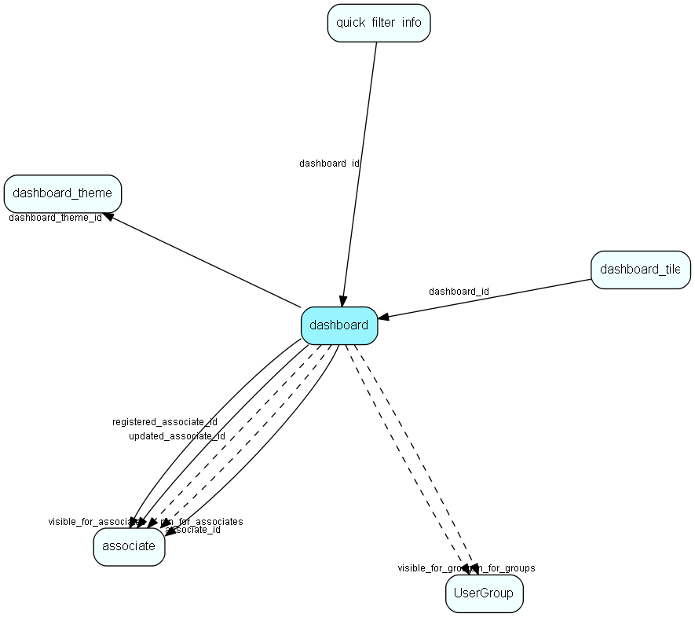

# dashboard Table (479)

Describes a dashboard

## Fields

| Name | Description | Type | Null |
|------|-------------|------|:----:|
|dashboard\_id|Primary key|PK| |
|associate\_id|Associate who owns this dashboard|FK [associate](associate.md)|&#x25CF;|
|name|The name of this dashboard|String(4000)|&#x25CF;|
|description|Detailed description|String(4000)|&#x25CF;|
|dashboard\_theme\_id|The theme belongs to set of slyle rules for the dashboard|FK [dashboard_theme](dashboard-theme.md)|&#x25CF;|
|registered|Registered when|UtcDateTime| |
|registered\_associate\_id|Registered by whom|FK [associate](associate.md)| |
|updated|Last updated when|UtcDateTime| |
|updated\_associate\_id|Last updated by whom|FK [associate](associate.md)| |
|updatedCount|Number of updates made to this record|UShort| |
|visible\_for\_all|True if visible for all|Bool|&#x25CF;|
|visible\_for\_associates|Array of references to the visible for associates|FKArray|&#x25CF;|
|visible\_for\_groups|Array of references to the visible for groups|FKArray|&#x25CF;|
|pin\_for\_all|True if pinned for all|Bool|&#x25CF;|
|pin\_for\_associates|Array of references to the pinned associates|FKArray|&#x25CF;|
|pin\_for\_groups|Array of references to the pinned groups|FKArray|&#x25CF;|
|columns|How many columns there will be in the dashboard.|Int|&#x25CF;|
|guid|GUID identifying a default dashboard from SuperOffice|String(36)|&#x25CF;|

[!include[details](./includes/dashboard.md)]

## Indexes

| Fields | Types | Description |
|--------|-------|-------------|
|dashboard\_id |PK |Clustered, Unique |
|associate\_id |FK |Index |

## Relationships

| Table|  Description |
|------|-------------|
|[associate](associate.md)  |Employees, resources and other users - except for External persons |
|[dashboard\_theme](dashboard-theme.md)  |A set of style rules for the Dashboard |
|[dashboard\_tile](dashboard-tile.md)  |Represents one tile in the dashboard |
|[UserGroup](usergroup.md)  |Secondary user groups |

## Replication Flags

* None

## Security Flags

* Sentry controls access to items in this table using user's Role and data rights matrix.

