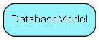

# DatabaseModel Table (456)

New DatabaseModel used by Continuous Database

## Fields

| Name | Description | Type | Null |
|------|-------------|------|:----:|
|databasemodel\_id|Primary key|PK| |
|ModelVersion|Model type version name - not the data, but the structure of the model itself|String(128)| |
|IsDatabaseUnicode|Almost all databases are unicode capable|Bool|&#x25CF;|
|ModelData|Compressed json string containing DatabaseModel of the given version|Blob|&#x25CF;|

[!include[details](./includes/databasemodel.md)]

## Indexes

| Fields | Types | Description |
|--------|-------|-------------|
|databasemodel\_id |PK |Clustered, Unique |

## Replication Flags

* None

## Security Flags

* No access control via user's Role.

