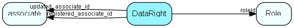

# DataRight Table (195)

Data right definition

## Fields

| Name | Description | Type | Null |
|------|-------------|------|:----:|
|DataRight\_id|Primary key|PK| |
|roleId|Role this dataright is valid for|FK [Role](role.md)| |
|tableId|ID of table this right is valid for|TableNumber| |
|fieldId|ID of field this right is valid for. 0 = whole table. Must correspond to tableId!|FieldId| |
|relationToOwner|How is the owner related to the target -  0 = Owner, 1 = Primary group, 2 = Other, 3 = Other group, 4 = External, 5 = Anonymous, 6 = My company, 7 = Same project, 8 = Other to external, 9 = Hide this relation (used with ShownOtherCompanyAssoc functional right)|Enum [RelationToOwner](enums/relationtoowner.md)| |
|CRUD|Allowed operations, composed of characters indicating operations.|String(39)| |
|encryptedCheck|Encrypted data, to detect unwanted changes|String(254)| |
|registered|Registered when|UtcDateTime| |
|registered\_associate\_id|Registered by whom|FK [associate](associate.md)| |
|updated|Last updated when|UtcDateTime| |
|updated\_associate\_id|Last updated by whom|FK [associate](associate.md)| |
|updatedCount|Number of updates made to this record|UShort| |

[!include[details](./includes/dataright.md)]

## Indexes

| Fields | Types | Description |
|--------|-------|-------------|
|DataRight\_id |PK |Clustered, Unique |
|roleId |FK |Index |
|roleId, tableId, fieldId, relationToOwner |FK, TableNumber, FieldId, Enum |Unique |

## Relationships

| Table|  Description |
|------|-------------|
|[associate](associate.md)  |Employees, resources and other users - except for External persons |
|[Role](role.md)  |User roles for role-based security, names and tooltips are in LocaleText. For more information regarding role based security, see http://techdoc.superoffice.com |

## Replication Flags

* Replicate changes DOWN from central to satellites and travellers.
* Replicate changes UP from satellites and travellers back to central.
* Copy to satellite and travel prototypes.

## Security Flags

* No access control via user's Role.

