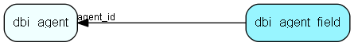

# dbi\_agent\_field Table (382)

DBI agent fields

## Fields

| Name | Description | Type | Null |
|------|-------------|------|:----:|
|id|Primary key|PK| |
|agent\_id|The agent owning this field|FK [dbi_agent](dbi-agent.md)| |
|field\_name|Field name|String(255)|&#x25CF;|

[!include[details](./includes/dbi-agent-field.md)]

## Indexes

| Fields | Types | Description |
|--------|-------|-------------|
|id |PK |Clustered, Unique |
|agent\_id |FK |Index |

## Relationships

| Table|  Description |
|------|-------------|
|[dbi\_agent](dbi-agent.md)  |DBI agent settings |

## Replication Flags

* None

## Security Flags

* No access control via user's Role.

