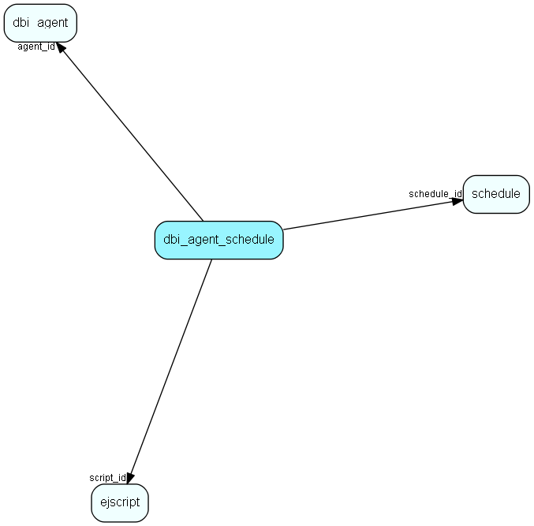

# dbi\_agent\_schedule Table (383)

DBI agent schedule settings

## Fields

| Name | Description | Type | Null |
|------|-------------|------|:----:|
|id|Primary key|PK| |
|agent\_id|Agent|FK [dbi_agent](dbi-agent.md)|&#x25CF;|
|script\_id|Communication script|FK [ejscript](ejscript.md)|&#x25CF;|
|schedule\_id|Update schedule|FK [schedule](schedule.md)|&#x25CF;|
|sent\_objects|Number of objects sent during the last syncronization|Int| |
|received\_objects|Number of objects received during the last syncronization|Int| |
|id\_string|A field for an id_string which may be used to access the agent schedule|String(255)| |

[!include[details](./includes/dbi-agent-schedule.md)]

## Indexes

| Fields | Types | Description |
|--------|-------|-------------|
|id |PK |Clustered, Unique |
|agent\_id |FK |Index |
|script\_id |FK |Index |
|schedule\_id |FK |Index |

## Relationships

| Table|  Description |
|------|-------------|
|[dbi\_agent](dbi-agent.md)  |DBI agent settings |
|[ejscript](ejscript.md)  |ejscript |
|[schedule](schedule.md)  |Generic scheduled tasked handling time scheduling, locking and error messages |

## Replication Flags

* None

## Security Flags

* No access control via user's Role.

