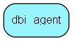

# dbi\_agent Table (381)

DBI agent settings

## Fields

| Name | Description | Type | Null |
|------|-------------|------|:----:|
|id|Primary key|PK| |
|name|Agent name|String(255)|&#x25CF;|
|id\_string|A field for an id_string which may be used to access the dbi agent|String(255)| |
|protocol|Agent communcication protocol |protocol|&#x25CF;|
|path|Path to agent URL or file path|String(255)|&#x25CF;|

[!include[details](./includes/dbi-agent.md)]

## Indexes

| Fields | Types | Description |
|--------|-------|-------------|
|id |PK |Clustered, Unique |

## Relationships

| Table|  Description |
|------|-------------|
|[attachment](attachment.md)  |This table contains metadata for attachments. The actual attachments are stored directly on disk, with filenames based on the the primary key for this table. |
|[contact](contact.md)  |Companies and Organizations.   This table features a special record containing information about the contact that owns the database.   |
|[dbi\_agent\_field](dbi-agent-field.md)  |DBI agent fields |
|[dbi\_agent\_schedule](dbi-agent-schedule.md)  |DBI agent schedule settings |
|[eab\_entry](eab-entry.md)  |This table contains eab (email address book) entries, i.e. an alias (&amp;apos;Ola Hansen&amp;apos;) and an address (&amp;apos;ola@hansen.as&amp;apos;). |
|[ejuser](ejuser.md)  |This table contains entries for the users of the system. |
|[Email](email.md)  |Email addresses for contacts, projects and persons |
|[kb\_category](kb-category.md)  |Knowledge base folder hierarchy |
|[kb\_entry](kb-entry.md)  |This table contains FAQ entries. |
|[kb\_entry\_comment](kb-entry-comment.md)  |Comments to entries in the knowledge base, typically made by customers |
|[kb\_group](kb-group.md)  |This table contains FAQ groups. A group is a cluster of entries (potentially located anywhere in the FAQ hierarchy). A group is located in a certain category. |
|[person](person.md)  |Persons in a company or an organizations. All associates have a corresponding person record |
|[s\_list](s-list.md)  |A list, dynamic or static |
|[ticket](ticket.md)  |This table contains the tickets (requests) of the system. Its purpose should be evident. |

## Replication Flags

* None

## Security Flags

* No access control via user's Role.

