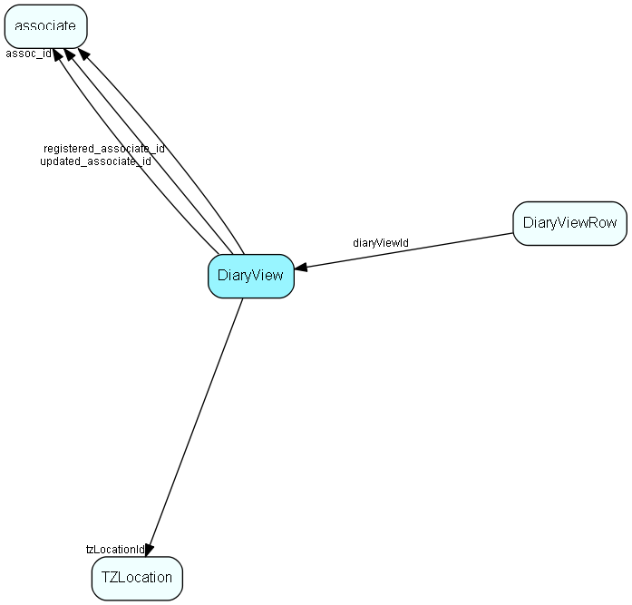

# DiaryView Table (214)

Configuration of a multi-user diary view

## Fields

| Name | Description | Type | Null |
|------|-------------|------|:----:|
|DiaryView\_id|Primary key|PK| |
|assoc\_id|Owning associate|FK [associate](associate.md)| |
|name|The name of the view (defined by the user during saving)|String(254)| |
|rank|Sorting rank|UShort| |
|tooltip|Tooltip shown in dropdown list|String(254)|&#x25CF;|
|visibleColumns|The number of columns to actually show in this view (as opposed to the number of columns defined)|UShort| |
|extraInfo|Extra information, whatever it might be|String(254)| |
|registered|Registered when|UtcDateTime| |
|registered\_associate\_id|Registered by whom|FK [associate](associate.md)| |
|updated|Last updated when|UtcDateTime| |
|updated\_associate\_id|Last updated by whom|FK [associate](associate.md)| |
|updatedCount|Number of updates made to this record|UShort| |
|tzLocationId|Default timezone location for this view|FK [TZLocation](tzlocation.md)|&#x25CF;|

[!include[details](./includes/diaryview.md)]

## Indexes

| Fields | Types | Description |
|--------|-------|-------------|
|DiaryView\_id |PK |Clustered, Unique |
|assoc\_id |FK |Index |

## Relationships

| Table|  Description |
|------|-------------|
|[associate](associate.md)  |Employees, resources and other users - except for External persons |
|[DiaryViewRow](diaryviewrow.md)  |Configuration of a multi-user diary view |
|[TZLocation](tzlocation.md)  |Time zone location |

## Replication Flags

* Replicate changes DOWN from central to satellites and travellers.
* Replicate changes UP from satellites and travellers back to central.
* Copy to satellite and travel prototypes.

## Security Flags

* No access control via user's Role.

