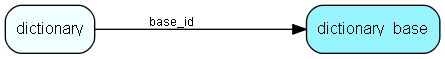

# dictionary\_base Table (359)

Language catalog for the ejournal dictionaries (automatic proof reading of message text etc)

## Fields

| Name | Description | Type | Null |
|------|-------------|------|:----:|
|id|Primary key|PK| |
|name|The name of the language|String(32)| |
|code|Language code name (no, en)|String(8)| |
|flags|A bitmask of dictionary flags|Int| |

[!include[details](./includes/dictionary-base.md)]

## Indexes

| Fields | Types | Description |
|--------|-------|-------------|
|id |PK |Clustered, Unique |

## Relationships

| Table|  Description |
|------|-------------|
|[dictionary](dictionary.md)  |User added dictionary words |

## Replication Flags

* None

## Security Flags

* No access control via user's Role.

