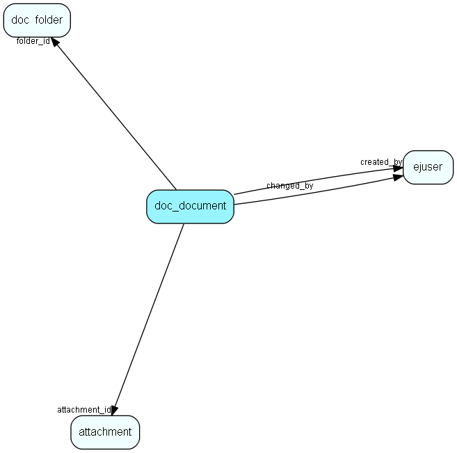

# doc\_document Table (280)

This table contains documents.

## Fields

| Name | Description | Type | Null |
|------|-------------|------|:----:|
|id|The primary key (auto-incremented)|PK| |
|folder\_id|The id of the document folder this entry is located in.|FK [doc_folder](doc-folder.md)| |
|attachment\_id|The attachment.id for the attachment associated with this document.|FK [attachment](attachment.md)| |
|title|The title for the document|String(255)| |
|created\_at|When the document was created|DateTime|&#x25CF;|
|created\_by|Who created the document|FK [ejuser](ejuser.md)| |
|last\_changed|When the document last was changed|DateTime|&#x25CF;|
|changed\_by|Who last changed the document|FK [ejuser](ejuser.md)|&#x25CF;|
|status|The status of the document|status|&#x25CF;|
|access\_level|The access level of the document|access_level|&#x25CF;|
|description|A descriptive text for the document|Clob|&#x25CF;|
|id\_string|A field for an id_string which may be used to access the document|String(255)| |

[!include[details](./includes/doc-document.md)]

## Indexes

| Fields | Types | Description |
|--------|-------|-------------|
|id |PK |Clustered, Unique |
|folder\_id |FK |Index |
|attachment\_id |FK |Index |
|title |String(255) |Index |
|created\_by |FK |Index |
|changed\_by |FK |Index |

## Relationships

| Table|  Description |
|------|-------------|
|[attachment](attachment.md)  |This table contains metadata for attachments. The actual attachments are stored directly on disk, with filenames based on the the primary key for this table. |
|[doc\_folder](doc-folder.md)  |A document folder. |
|[ejuser](ejuser.md)  |This table contains entries for the users of the system. |

## Replication Flags

* None

## Security Flags

* No access control via user's Role.

