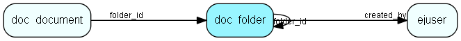

# doc\_folder Table (281)

A document folder.

## Fields

| Name | Description | Type | Null |
|------|-------------|------|:----:|
|id|The primary id (auto-incremented)|PK| |
|folder\_id|The parent folder. -1 if this is a root folder.|FK [doc_folder](doc-folder.md)| |
|title|The title of the folder|String(255)| |
|created\_at|When the folder was created.|DateTime|&#x25CF;|
|created\_by|The used who created the folder.|FK [ejuser](ejuser.md)|&#x25CF;|
|status|The status of the folder.|status|&#x25CF;|
|access\_level|The access level for the folder|access_level|&#x25CF;|
|inherited\_access\_level|The lowest access level for this folder or any parent|inherited_access_level|&#x25CF;|
|fullname|The full name of this category, i.e. Foo/bar/test.|Clob|&#x25CF;|

[!include[details](./includes/doc-folder.md)]

## Indexes

| Fields | Types | Description |
|--------|-------|-------------|
|id |PK |Clustered, Unique |
|folder\_id |FK |Index |
|title |String(255) |Index |
|created\_by |FK |Index |

## Relationships

| Table|  Description |
|------|-------------|
|[doc\_document](doc-document.md)  |This table contains documents. |
|[doc\_folder](doc-folder.md)  |A document folder. |
|[ejuser](ejuser.md)  |This table contains entries for the users of the system. |

## Replication Flags

* None

## Security Flags

* No access control via user's Role.

